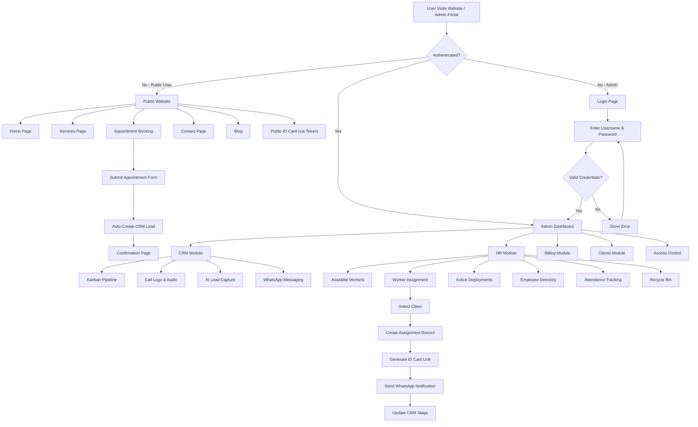
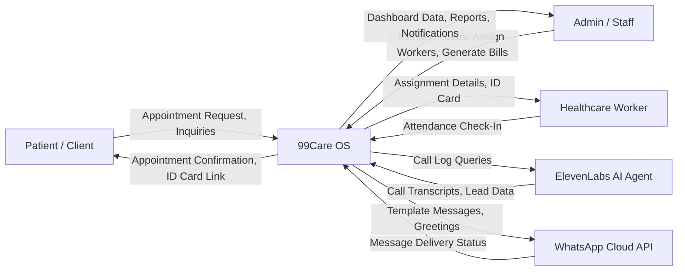
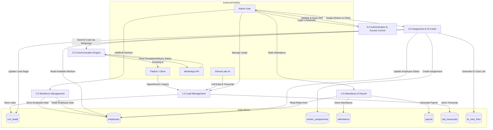
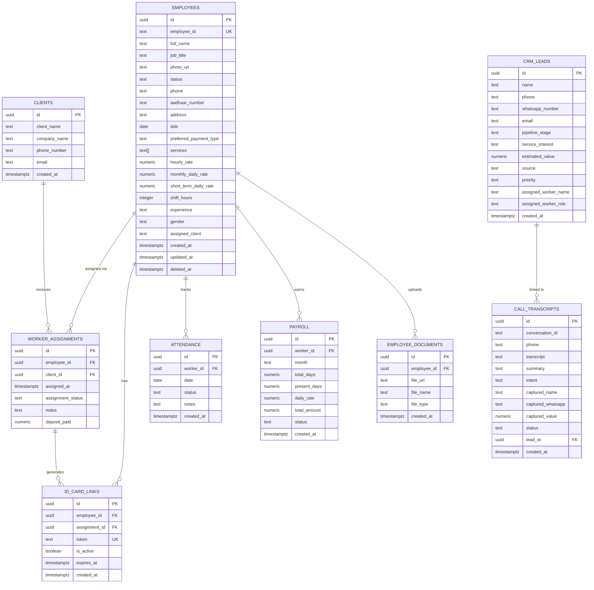
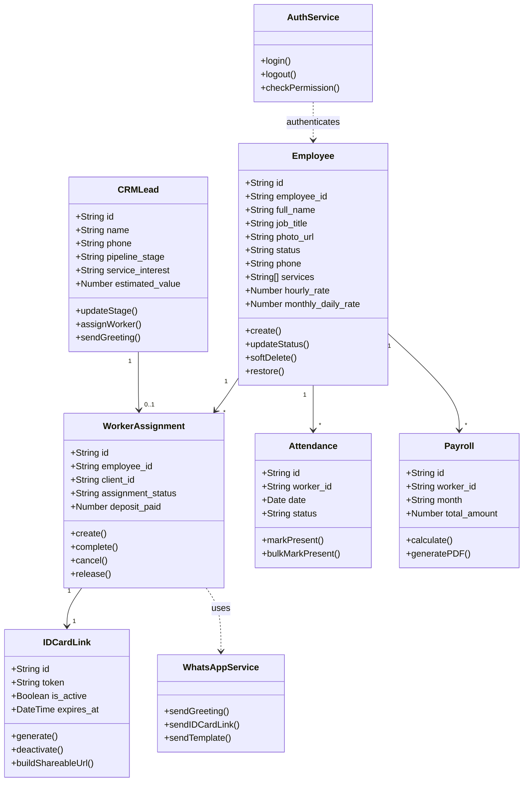
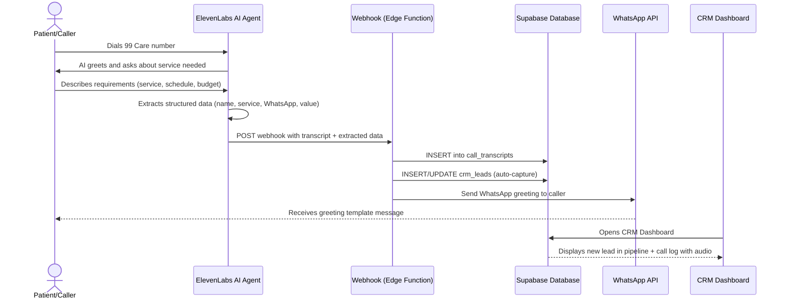
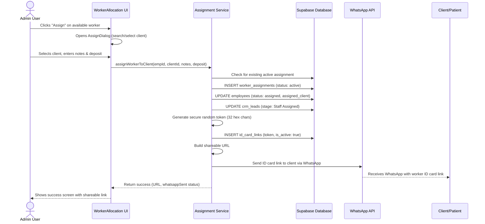

# CHAPTER 7: SOFTWARE/SYSTEM DESIGN

## 7.1 System Flowchart

The following flowchart illustrates the overall flow of the 99Care OS system from user entry to the various functional modules:

---

## 7.2 Data Flow Diagram — Level 0 (Context Diagram)

The context diagram shows the system as a single process with its external entities:

---

## 7.3 Data Flow Diagram — Level 1

The Level 1 DFD breaks the system into its major processes:

---

## 7.4 Entity Relationship Diagram (ERD)

---

## 7.5 Use Case Diagram

```mermaid
flowchart TD
    subgraph Actors
        Admin["🧑‍💼 Admin"]
        Client["🏠 Client / Patient"]
        Worker["👩‍⚕️ Healthcare Worker"]
        AI["🤖 AI Voice Agent"]
    end

    subgraph UseCases["99Care OS — Use Cases"]
        UC1["Login / Authenticate"]
        UC2["View Dashboard"]
        UC3["Manage CRM Pipeline"]
        UC4["View Call Logs"]
        UC5["Send WhatsApp Greeting"]
        UC6["Add Lead to Pipeline"]
        UC7["Add New Employee"]
        UC8["Assign Worker to Client"]
        UC9["Generate Digital ID Card"]
        UC10["Track Attendance"]
        UC11["Calculate Payroll"]
        UC12["Manage Access Control"]
        UC13["Book Appointment Online"]
        UC14["View Public ID Card"]
        UC15["Handle Inbound Call"]
        UC16["Auto-Capture Lead Data"]
        UC17["Release Worker from Client"]
        UC18["Manage Recycle Bin"]
        UC19["Generate Invoice PDF"]
        UC20["Browse Services"]
    end

    Admin --> UC1
    Admin --> UC2
    Admin --> UC3
    Admin --> UC4
    Admin --> UC5
    Admin --> UC6
    Admin --> UC7
    Admin --> UC8
    Admin --> UC9
    Admin --> UC10
    Admin --> UC11
    Admin --> UC12
    Admin --> UC17
    Admin --> UC18
    Admin --> UC19

    Client --> UC13
    Client --> UC14
    Client --> UC20

    Worker --> UC14

    AI --> UC15
    AI --> UC16
```

---

## 7.6 Class Diagram

---

## 7.7 Sequence Diagram — Lead Intake Flow (AI Voice Call)

---

## 7.8 Sequence Diagram — Worker Assignment Flow

---
