# CHAPTER 1: PRELIMINARY PAGES

---

## 1.1 Front Wrapper Cover Page

> **Major Project / Internship Documentation**
>
> **BSc IT**
>
> **AURO University, Surat**

---

## 1.2 Title Page

<center>

### A PROJECT REPORT

### ON

### "99Care OS — AI-Powered Healthcare Operations Management System with Integrated CRM, HR & Billing"

### 99 CARE

PROJECT REPORT SUBMITTED IN THE PARTIAL FULFILLMENT FOR THE DEGREE OF

### BACHELOR OF SCIENCE

### IN

### INFORMATION TECHNOLOGY
### (BSc IT)

### SUBMITTED

### BY

### TANISHQ KACHIWALA
### (212023042) (2023–26)

### UNDER THE GUIDANCE OF

### Dr. Sunil Kumar

**AURO UNIVERSITY, SURAT, GUJARAT**

**Academic Year – 2025–26**

</center>

---

## 1.3 Certificate of Undertaking (Student Declaration)

### CERTIFICATE OF UNDERTAKING
### (DECLARATION)

I, **Tanishq Kachiwala**, Enrollment No. **212023042**, hereby declare that the project entitled **"99Care OS — AI-Powered Healthcare Operations Management System with Integrated CRM, HR & Billing"**, undertaken at the **School of Information Technology**, is submitted in partial fulfillment of the requirements for the degree of **Bachelor of Science in Information Technology**.

I further declare that this project is my original work and has not been submitted, either in part or in full, for the award of any other degree, diploma, associate ship, fellowship, or any other similar title in **AURO University** or any other University/Institution.

Date: _______________

Place: Surat

&nbsp;

&nbsp;

**Signature of the Student**
Tanishq Kachiwala
Enrollment No.: 212023042

---

## 1.4 Certificate from Institute

### SCHOOL OF INFORMATION TECHNOLOGY

### CERTIFICATE

This is to certify that the project entitled **"99Care OS — AI-Powered Healthcare Operations Management System with Integrated CRM, HR & Billing"** has been successfully carried out by the following student(s) under my guidance in the partial fulfillment of the requirements for the degree of **Bachelor of Science in Information Technology** of **AURO University, Surat**, during the academic year **2025–26 (Semester VI)**.

**Student(s):**

1. 212023042 – Tanishq Kachiwala

Date: _______________
Place: Surat

&nbsp;

&nbsp;

**Dr. Sunil Kumar**
Project Guide / Supervisor

&nbsp;

&nbsp;

**Dr. Anurag Dixit**
Head, School of Information Technology

---

## 1.5 Certificate from Company

_(Refer to the attached Non-Disclosure Compliance (NDC) Certificate from 99 Care, signed by Mr. Divyesh Patel, Director.)_

---

## 1.6 Acknowledgement

### ACKNOWLEDGEMENT

I would like to express my sincere gratitude to all those who have contributed to the successful completion of this project.

First and foremost, I am deeply thankful to my internal faculty guide, **Dr. Sunil Kumar**, for his invaluable guidance, continuous support, and constructive feedback throughout the project development process. His expertise and mentorship have been instrumental in shaping this project.

I extend my heartfelt thanks to **Dr. Anurag Dixit**, Head of the School of Information Technology, AURO University, Surat, for providing the necessary infrastructure and academic environment that facilitated this work.

I am especially grateful to **Mr. Divyesh Patel**, Director of **99 Care**, for giving me the opportunity to work on a real-world healthcare operations management system. His domain expertise in the healthcare industry provided crucial insights into the business requirements that shaped the system's architecture.

I also wish to thank the entire team at 99 Care for their cooperation, timely feedback, and for providing access to the necessary resources and APIs that made this project possible.

Finally, I would like to thank my family and friends for their unwavering encouragement and moral support throughout this journey.

&nbsp;

**Tanishq Kachiwala**
212023042
BSc IT, Semester VI
AURO University, Surat

---

## 1.7 Table of Contents

| Chapter | Title | Page No. |
|---------|-------|----------|
| | NOC / NDC Certificate | |
| | Certificate of Undertaking (Declaration) | |
| | Certificate from Institute | |
| | Certificate from Company | |
| | Acknowledgement | |
| | Table of Contents | |
| | List of Figures | |
| | List of Tables | |
| | List of Abbreviations | |
| 1 | Preliminary Pages | |
| 2 | Introduction of the Project | |
| 3 | Software/System Requirement Study | |
| 4 | Objective of the Software | |
| 5 | Feasibility Study | |
| 6 | System Analysis | |
| 7 | Software/System Design | |
| 8 | Front-End Screens | |
| 9 | Database Design | |
| 10 | Back-End Description | |
| 11 | Implementation | |
| 12 | Source Code | |
| 13 | Testing and Implementation | |
| 14 | Results and Discussion | |
| 15 | Limitations | |
| 16 | Future Enhancements | |
| 17 | Conclusion | |
| 18 | Bibliography / References | |
| 19 | Appendix | |

_(Page numbers to be filled after final formatting)_

---

## 1.8 List of Figures

| Fig. No. | Title | Page No. |
|----------|-------|----------|
| 7.1 | System Flowchart | |
| 7.2 | Data Flow Diagram – Level 0 (Context Diagram) | |
| 7.3 | Data Flow Diagram – Level 1 | |
| 7.4 | Entity Relationship Diagram (ERD) | |
| 7.5 | Use Case Diagram | |
| 7.6 | Class Diagram | |
| 7.7 | Sequence Diagram – Lead Intake Flow | |
| 7.8 | Sequence Diagram – Worker Assignment Flow | |
| 8.1 | Public Website – Home Page | |
| 8.2 | Public Website – Services Page | |
| 8.3 | Public Website – Appointment Booking | |
| 8.4 | Login Screen | |
| 8.5 | Admin Dashboard | |
| 8.6 | CRM – Kanban Pipeline View | |
| 8.7 | CRM – Call Logs with AI Summary | |
| 8.8 | HR – Available Workers Tab | |
| 8.9 | HR – Active Deployments Tab | |
| 8.10 | HR – Employee Directory | |
| 8.11 | HR – Attendance Matrix | |
| 8.12 | HR – Worker Assignment Dialog | |
| 8.13 | HR – Digital ID Card Preview | |
| 8.14 | Billing Module | |
| 8.15 | Access Control / Settings | |
| 9.1 | Database Schema Diagram | |

_(Page numbers to be filled after final formatting)_

---

## 1.9 List of Tables

| Table No. | Title | Page No. |
|-----------|-------|----------|
| 3.1 | Hardware Requirements | |
| 3.2 | Software Requirements | |
| 3.3 | Tools and Technologies | |
| 6.1 | Functional Requirements | |
| 6.2 | Non-Functional Requirements | |
| 9.1 | employees Table Structure | |
| 9.2 | crm_leads Table Structure | |
| 9.3 | worker_assignments Table Structure | |
| 9.4 | id_card_links Table Structure | |
| 9.5 | clients Table Structure | |
| 9.6 | attendance Table Structure | |
| 9.7 | payroll Table Structure | |
| 9.8 | call_transcripts Table Structure | |
| 13.1 | Test Cases – CRM Module | |
| 13.2 | Test Cases – HR Module | |
| 13.3 | Test Cases – Authentication | |
| 13.4 | Test Cases – Public Website | |

_(Page numbers to be filled after final formatting)_

---

## 1.10 List of Abbreviations

| Abbreviation | Full Form |
|-------------|-----------|
| AI | Artificial Intelligence |
| API | Application Programming Interface |
| BaaS | Backend as a Service |
| CRUD | Create, Read, Update, Delete |
| CRM | Customer Relationship Management |
| CSS | Cascading Style Sheets |
| DFD | Data Flow Diagram |
| ERD | Entity Relationship Diagram |
| HR | Human Resource Management |
| HTML | HyperText Markup Language |
| HTTP | HyperText Transfer Protocol |
| JSON | JavaScript Object Notation |
| JWT | JSON Web Token |
| NDC | Non-Disclosure Compliance |
| OS | Operations System |
| PDF | Portable Document Format |
| PK | Primary Key |
| FK | Foreign Key |
| PWA | Progressive Web Application |
| RBAC | Role-Based Access Control |
| REST | Representational State Transfer |
| RLS | Row Level Security |
| SEO | Search Engine Optimization |
| SQL | Structured Query Language |
| TSX | TypeScript JSX |
| UAT | User Acceptance Testing |
| UI | User Interface |
| URL | Uniform Resource Locator |
| UUID | Universally Unique Identifier |

---


# CHAPTER 2: INTRODUCTION OF THE PROJECT

## 2.1 Background of the Project

The healthcare industry in India is undergoing a significant digital transformation. Home healthcare services, in particular, have seen tremendous growth in recent years, driven by an aging population, increasing chronic diseases, and the convenience of receiving medical care at home. However, many home healthcare companies still rely on manual processes for managing their operations — from tracking patient inquiries and assigning healthcare workers, to managing attendance, billing, and client communication.

**99 Care** is a home healthcare services provider based in Surat, Gujarat, that offers a wide range of services including elderly care, post-surgical care, baby care, physiotherapy, nursing, and more. Before the development of this system, the company relied on a fragmented set of tools — phone calls, spreadsheets, WhatsApp messages, and manual record-keeping — to manage their day-to-day operations.

The need for a centralized, intelligent, and automated operations management system became increasingly apparent as the company scaled its workforce and client base. This project was undertaken to address this critical gap by building **99Care OS** — a comprehensive, AI-powered healthcare operations management platform.

The system was developed as a full-stack web application using modern technologies including React, TypeScript, Supabase (PostgreSQL), and integrated with third-party AI services such as ElevenLabs for conversational AI voice agents and Meta's WhatsApp Cloud API for automated client communication.

---

## 2.2 Problem Statement

Home healthcare companies face several operational challenges that hinder their growth and efficiency:

1. **Fragmented Lead Management**: Incoming patient/client inquiries arrive through multiple channels — phone calls, WhatsApp messages, website forms — with no centralized system to track, prioritize, or follow up on them. Leads are frequently lost or delayed due to manual handling.

2. **Inefficient Workforce Allocation**: Assigning healthcare workers (nurses, attendants, therapists) to clients involves checking availability, matching skills, and managing schedules — all done manually through phone calls and spreadsheets, leading to delays and double-bookings.

3. **Lack of Communication Automation**: Post-inquiry follow-ups, appointment confirmations, staff assignment notifications, and review requests are all handled manually via individual WhatsApp messages, consuming significant staff time and leading to inconsistencies.

4. **No Digital Identity Management**: Healthcare workers visiting client homes had no standardized identity verification system. Paper-based ID cards were easily misplaced or forged, creating trust and safety concerns for clients.

5. **Manual Attendance and Payroll**: Tracking daily attendance of field workers and calculating their pay based on different rate structures (hourly, daily, monthly) was done through paper registers, resulting in errors and disputes.

6. **No Data-Driven Decision Making**: Without a centralized system, the company had no visibility into key metrics like lead conversion rates, worker utilization, revenue trends, or operational bottlenecks.

---

## 2.3 Need and Significance of the System

The significance of the 99Care OS system can be understood from the following perspectives:

### For the Business (99 Care)
- **Operational Efficiency**: Automating lead capture, worker assignment, attendance tracking, and billing reduces the time and effort required to manage daily operations by an estimated 60–70%.
- **Revenue Growth**: AI-powered call handling and automated WhatsApp follow-ups ensure no lead is missed, directly impacting conversion rates and revenue.
- **Scalability**: The cloud-based architecture allows the company to scale from managing 10 workers to 100+ without proportional increases in administrative overhead.
- **Data Visibility**: Real-time dashboards provide management with actionable insights into pipeline health, workforce utilization, and financial performance.

### For Clients (Patients and Families)
- **Trust and Safety**: Digital ID cards with shareable links allow clients to verify the identity and credentials of healthcare workers assigned to their home, enhancing trust and safety.
- **Better Communication**: Automated WhatsApp notifications keep clients informed about staff assignments, schedule changes, and service updates in real-time.
- **Convenient Booking**: The public-facing website allows clients to book appointments, explore services, and contact the company without the need for phone calls.

### For Healthcare Workers
- **Digital Identity**: Professional digital ID cards with unique shareable links provide workers with a verifiable identity that enhances their professional image.
- **Transparent Payroll**: Automated attendance tracking and payroll calculation ensure accurate and timely compensation.
- **Clear Assignments**: Workers receive clear assignment details including client information and service requirements through the system.

### Academic Significance
- This project demonstrates the practical application of modern web development technologies (React, TypeScript, Supabase) combined with AI services (ElevenLabs, Meta WhatsApp API) to solve real-world business problems.
- It showcases the integration of multiple complex subsystems — CRM, HR, billing, and communication — into a cohesive, production-ready application.
- The project provides hands-on experience with industry-standard tools and practices including version control (Git/GitHub), cloud hosting (Vercel), serverless functions, and real-time databases.

---


# CHAPTER 3: SOFTWARE/SYSTEM REQUIREMENT STUDY

## 3.1 Hardware Requirements

The system is a cloud-hosted web application and does not require specialized hardware for deployment. However, the following hardware specifications are recommended for development and end-user access:

### Table 3.1: Hardware Requirements

#### For Development
| Component | Minimum Requirement |
|-----------|-------------------|
| Processor | Intel Core i5 / Apple M1 or equivalent |
| RAM | 8 GB (16 GB recommended) |
| Storage | 256 GB SSD |
| Display | 13-inch, 1920×1080 resolution |
| Internet | Broadband with minimum 10 Mbps speed |

#### For End Users (Admin/Staff)
| Component | Minimum Requirement |
|-----------|-------------------|
| Device | Desktop, Laptop, Tablet, or Smartphone |
| Browser | Google Chrome 90+, Safari 15+, Firefox 88+, Edge 90+ |
| Internet | Broadband or 4G/5G mobile data |
| Screen Resolution | Minimum 1024×768 (responsive design supports all sizes) |

#### For Server/Hosting
| Component | Specification |
|-----------|--------------|
| Cloud Provider | Supabase (PostgreSQL 15, hosted on AWS) |
| Frontend Hosting | Vercel (Edge Network, Global CDN) |
| Storage | Supabase Storage (S3-compatible object storage) |
| Edge Functions | Supabase Edge Functions (Deno runtime) |

---

## 3.2 Software Requirements

### Table 3.2: Software Requirements

#### Development Environment
| Software | Version | Purpose |
|----------|---------|---------|
| Node.js | 20.x LTS | JavaScript runtime for development tooling |
| npm | 10.x | Package manager |
| Visual Studio Code | Latest | Primary code editor / IDE |
| Git | 2.x | Version control system |
| GitHub | — | Remote repository hosting |
| Supabase CLI | Latest | Local development and migration management |

#### Operating System Compatibility
| OS | Supported Versions |
|----|-------------------|
| Windows | Windows 10 / 11 |
| macOS | macOS 12 (Monterey) or later |
| Linux | Ubuntu 20.04 LTS or later |
| Mobile | Android 10+ / iOS 15+ (via browser) |

---

## 3.3 Tools and Technologies Used

### Table 3.3: Tools and Technologies

| Category | Technology | Version | Purpose |
|----------|-----------|---------|---------|
| **Frontend Framework** | React | 19.2 | Component-based UI library for building interactive user interfaces |
| **Language** | TypeScript | 5.9 | Strongly-typed superset of JavaScript for type safety and developer experience |
| **Build Tool** | Vite | 7.x | Next-generation frontend build tool with fast HMR (Hot Module Replacement) |
| **CSS Framework** | Tailwind CSS | 3.4 | Utility-first CSS framework for rapid UI development |
| **UI Components** | shadcn/ui (Radix) | Latest | Accessible, customizable component library built on Radix UI primitives |
| **Icons** | Lucide React | 0.562 | Modern, consistent icon library with 1000+ icons |
| **Animations** | Framer Motion | 12.x | Production-ready motion library for React animations |
| **Charts** | Recharts | 2.15 | Composable charting library built on React and D3 |
| **Routing** | React Router DOM | 7.x | Client-side routing for single-page application navigation |
| **State Management** | TanStack React Query | 5.x | Data fetching and server state management library |
| **Backend (BaaS)** | Supabase | 2.97 | Open-source Firebase alternative providing PostgreSQL database, authentication, real-time subscriptions, storage, and edge functions |
| **Database** | PostgreSQL | 15 | Enterprise-grade relational database (managed by Supabase) |
| **Authentication** | Supabase Auth | — | JWT-based authentication with Row Level Security (RLS) |
| **File Storage** | Supabase Storage | — | S3-compatible object storage for employee photos and documents |
| **Serverless Functions** | Supabase Edge Functions | — | Deno-based serverless functions for backend logic (webhooks, API integrations) |
| **AI Voice Agent** | ElevenLabs | — | Conversational AI platform for voice-based lead intake and customer interaction |
| **Messaging API** | Meta WhatsApp Cloud API | — | Official WhatsApp Business API for automated template messages and notifications |
| **PDF Generation** | jsPDF + AutoTable | 4.x | Client-side PDF generation for invoices and reports |
| **Form Validation** | Zod + React Hook Form | 4.x / 7.x | Schema-based form validation and management |
| **Hosting** | Vercel | — | Frontend hosting with global edge network, automatic deployments from GitHub |
| **Version Control** | Git + GitHub | — | Source code versioning and collaboration |
| **PWA** | Vite PWA Plugin | 1.2 | Progressive Web App support for mobile installability and offline capabilities |

---


# CHAPTER 4: OBJECTIVE OF THE SOFTWARE

## 4.1 Primary Objectives

The primary objectives of the 99Care OS system are:

1. **To design and develop a centralized healthcare operations management platform** that consolidates all critical business functions — CRM, HR, billing, and client communication — into a single, unified web application accessible from any device.

2. **To automate the lead management lifecycle** from initial inquiry (via phone call, WhatsApp, or website form) through qualification, staff assignment, and conversion to an active client, using AI-powered voice agents and automated messaging.

3. **To build an intelligent workforce allocation system** that enables administrators to manage healthcare worker profiles, track availability, assign workers to clients, and generate verifiable digital identity cards with secure shareable links.

4. **To implement automated client communication** via the WhatsApp Business API, enabling the system to send greeting messages, appointment confirmations, staff assignment notifications, and ID card links without manual intervention.

5. **To develop a comprehensive attendance and payroll management module** that tracks daily worker attendance, supports multiple payment structures (hourly, daily, monthly), and automates payroll calculations.

---

## 4.2 Secondary Objectives

1. **To create a professional public-facing website** for 99 Care that showcases services, enables online appointment booking, and serves as a marketing and SEO presence for the business.

2. **To implement role-based access control (RBAC)** that allows the system administrator to create staff accounts with specific module-level permissions, ensuring data security and operational segregation.

3. **To integrate AI-powered voice interaction** using ElevenLabs' Conversational AI platform, enabling the system to handle inbound phone calls, extract lead information (name, service needed, budget), and auto-populate the CRM pipeline.

4. **To ensure data security and privacy** through Supabase's Row Level Security (RLS) policies, JWT-based authentication, and secure token-based access for public-facing resources (ID cards).

5. **To build the system as a Progressive Web App (PWA)** that can be installed on mobile devices for quick access, providing a near-native app experience without requiring app store distribution.

6. **To design the system architecture for scalability**, using cloud-hosted infrastructure (Supabase + Vercel) with serverless edge functions that can scale automatically based on demand.

---

## 4.3 Expected Outcomes

Upon successful completion and deployment, the system is expected to deliver the following outcomes:

| # | Expected Outcome | Measurement |
|---|-----------------|-------------|
| 1 | **Reduction in lead response time** from hours to seconds through automated AI call handling and WhatsApp greetings | < 30 seconds for automated first contact |
| 2 | **Elimination of manual spreadsheet-based worker tracking** with a digital directory supporting search, filter, and real-time status updates | 100% digital workforce management |
| 3 | **Automated staff assignment workflow** including client notification via WhatsApp with digital ID card link | < 2 minutes per assignment vs. 15–20 minutes manual |
| 4 | **Accurate payroll calculation** with configurable rate structures and automatic attendance-based computation | Zero calculation errors |
| 5 | **Professional online presence** with a modern, responsive, SEO-optimized public website | Accessible on all devices |
| 6 | **Digital identity verification** for healthcare workers through secure, shareable ID card links | Unique token per assignment |
| 7 | **Centralized data visibility** through a real-time admin dashboard displaying key business metrics | Single source of truth |
| 8 | **Reduced administrative overhead** enabling the company to manage a larger workforce without proportional staff increase | 60–70% reduction in manual effort |

---


# CHAPTER 5: FEASIBILITY STUDY

A feasibility study was conducted to evaluate whether the proposed system is practical, achievable, and worthwhile from technical, economic, and operational perspectives.

---

## 5.1 Technical Feasibility

Technical feasibility assesses whether the required technology, tools, and expertise are available to build and deploy the system.

### Assessment: **FEASIBLE** ✓

| Factor | Analysis |
|--------|----------|
| **Frontend Technology** | React 19 with TypeScript is a mature, widely-adopted technology with extensive community support, comprehensive documentation, and a rich ecosystem of libraries. The developer has prior experience with React development. |
| **Backend Infrastructure** | Supabase provides a fully managed PostgreSQL database, authentication, file storage, and serverless edge functions — eliminating the need to set up and maintain a custom backend server. This significantly reduces the technical complexity and development time. |
| **AI Integration** | ElevenLabs provides well-documented REST APIs and webhook-based integration for conversational AI. The integration involves receiving webhook callbacks and making API calls, which is standard web development practice. |
| **WhatsApp Integration** | Meta's WhatsApp Cloud API provides official, documented endpoints for sending template messages. The integration uses Supabase Edge Functions as a middleware layer, which is a proven pattern. |
| **Deployment** | Vercel provides zero-configuration deployment for React/Vite applications with automatic builds from GitHub pushes. Supabase handles all backend infrastructure. No DevOps expertise is required. |
| **Development Tools** | All tools used (VS Code, Git, npm, Node.js) are free, open-source, and cross-platform. No proprietary or expensive development tools are needed. |
| **Skills Available** | The developer possesses working knowledge of JavaScript/TypeScript, React, SQL, REST APIs, and Git — all essential skills for this project. |

**Conclusion**: The project is technically feasible. All required technologies are mature, well-documented, and within the developer's skill set. The use of Supabase as a BaaS significantly reduces backend complexity.

---

## 5.2 Economic Feasibility

Economic feasibility evaluates whether the project can be developed and maintained within a reasonable budget.

### Assessment: **FEASIBLE** ✓

#### Development Costs

| Item | Cost | Notes |
|------|------|-------|
| Development Hardware | ₹0 | Existing laptop used for development |
| IDE / Code Editor | ₹0 | VS Code is free and open-source |
| Supabase (Free Tier) | ₹0 | Free tier provides 500 MB database, 1 GB storage, 50,000 monthly active users |
| Vercel (Free Tier) | ₹0 | Free tier provides 100 GB bandwidth, automatic HTTPS, global CDN |
| GitHub (Free Tier) | ₹0 | Free for public and private repositories |
| Domain Name | ₹800/year | For the public website (99care.org) — borne by the company |
| ElevenLabs API | Usage-based | Free tier available; production costs borne by the company |
| WhatsApp Cloud API | Usage-based | First 1,000 conversations/month free; costs borne by the company |
| **Total Development Cost** | **₹0** | All tools used are free/open-source |

#### Operational Costs (Monthly — Post-Deployment)

| Item | Estimated Cost | Notes |
|------|---------------|-------|
| Supabase Pro Plan | ₹2,100/mo (~$25) | For production-grade features (8 GB DB, 100 GB storage) |
| Vercel Pro | ₹1,680/mo (~$20) | For commercial use and team features |
| ElevenLabs API | ₹4,000–8,000/mo | Based on call volume (estimated 200–500 calls/month) |
| WhatsApp API | ₹1,000–3,000/mo | Based on message volume |
| **Total Monthly** | **~₹9,000–15,000/mo** | Borne entirely by 99 Care |

**Conclusion**: The project is economically feasible. The development cost is effectively zero due to the use of free and open-source tools. Operational costs are modest and appropriate for a growing healthcare business. The ROI is expected to be positive within 2–3 months of deployment through reduced administrative staff costs and increased lead conversion.

---

## 5.3 Operational Feasibility

Operational feasibility evaluates whether the system can be successfully adopted and used by the target users in the organization.

### Assessment: **FEASIBLE** ✓

| Factor | Analysis |
|--------|----------|
| **User Interface** | The system uses a clean, modern UI with intuitive navigation (sidebar menu, tab-based views, card layouts). No specialized training is required — users familiar with web-based tools (email, social media) can operate the system. |
| **Accessibility** | As a web application, the system is accessible from any device with a modern browser — desktop, laptop, tablet, or smartphone. No software installation is required. |
| **Learning Curve** | The system is designed with a low learning curve. Common patterns (search bars, dropdown menus, form inputs, buttons) follow standard web conventions that users are already familiar with. |
| **Data Migration** | The existing data (worker records, client lists) can be imported into the system through the Supabase database interface or the application's built-in forms. |
| **Support & Maintenance** | The codebase follows a modular architecture with clear separation of concerns. This makes it straightforward for a developer to maintain, debug, and extend the system in the future. |
| **Organizational Readiness** | 99 Care's management is committed to digital transformation and actively participated in defining requirements and providing feedback during development. |
| **Backup & Recovery** | Supabase provides automatic daily backups of the PostgreSQL database. Point-in-time recovery is available on the Pro plan, ensuring data safety. |

**Conclusion**: The project is operationally feasible. The web-based architecture ensures universal accessibility, and the intuitive UI design minimizes the need for user training. The company's management is supportive and engaged in the adoption process.

---

### Overall Feasibility Summary

| Dimension | Status | Remarks |
|-----------|--------|---------|
| Technical | ✓ Feasible | Mature tech stack, developer has required skills |
| Economic | ✓ Feasible | Zero development cost, modest operational costs |
| Operational | ✓ Feasible | Intuitive UI, universal access, management support |

**The project has been determined to be feasible across all three dimensions and is approved for development.**

---


# CHAPTER 6: SYSTEM ANALYSIS

## 6.1 Functional Requirements

Functional requirements define the specific behavior and functions that the system must perform. The following table categorizes the functional requirements by module:

### Table 6.1: Functional Requirements

#### A. Public Website Module
| FR ID | Requirement | Priority |
|-------|------------|----------|
| FR-01 | The system shall display a responsive home page with service highlights, testimonials, and call-to-action buttons. | High |
| FR-02 | The system shall provide a detailed services page listing all healthcare services offered by 99 Care. | High |
| FR-03 | The system shall allow visitors to book appointments through an online form, capturing name, phone, email, preferred date/time, and service type. | High |
| FR-04 | The system shall display a confirmation page after successful appointment booking. | Medium |
| FR-05 | The system shall provide a public-facing digital ID card page accessible via a unique shareable token URL. | High |
| FR-06 | The system shall include About, Contact, Blog, Privacy Policy, and Terms pages. | Medium |
| FR-07 | The system shall be installable as a PWA on mobile devices. | Low |

#### B. Authentication & Access Control Module
| FR ID | Requirement | Priority |
|-------|------------|----------|
| FR-08 | The system shall provide a login page with username and password authentication. | High |
| FR-09 | The system shall support role-based access control (RBAC) with module-level permissions (CRM, HR, Clients, Finance). | High |
| FR-10 | The system shall redirect unauthenticated users to the login page when accessing admin routes. | High |
| FR-11 | The system shall allow administrators to create, edit, and delete staff accounts with specific module access. | High |

#### C. CRM Module
| FR ID | Requirement | Priority |
|-------|------------|----------|
| FR-12 | The system shall display leads in a Kanban-style pipeline board with draggable cards across configurable stages. | High |
| FR-13 | The system shall allow manual creation of new leads with name, phone, email, service interest, and estimated value. | High |
| FR-14 | The system shall integrate with ElevenLabs to receive AI voice call data (transcripts, summaries, caller info) via webhooks. | High |
| FR-15 | The system shall display call logs with audio playback, AI-generated summaries, and captured lead data. | High |
| FR-16 | The system shall auto-capture leads from AI voice calls and add them to the pipeline. | High |
| FR-17 | The system shall send automated WhatsApp greeting messages to new leads. | High |
| FR-18 | The system shall allow assigning healthcare workers to leads directly from the CRM. | High |
| FR-19 | The system shall support lead stage transitions with automatic status updates and notifications. | Medium |
| FR-20 | The system shall track call transcripts linked to specific leads. | Medium |

#### D. HR / Workforce Management Module
| FR ID | Requirement | Priority |
|-------|------------|----------|
| FR-21 | The system shall allow adding new employees with profile details (name, job title, photo, phone, Aadhaar, address, DOB, services, payment type, rates, documents). | High |
| FR-22 | The system shall display available workers in a card-based grid view with search and filter capabilities. | High |
| FR-23 | The system shall support assigning workers to clients, generating a digital ID card link, and sending it via WhatsApp. | High |
| FR-24 | The system shall display active deployments (assignments) in a table with actions for ID card preview, link resend, release, and terminate. | High |
| FR-25 | The system shall provide a full employee directory with status filters (All, Available, Assigned, Inactive). | High |
| FR-26 | The system shall display a confirmation warning when changing an assigned worker's status to available. | High |
| FR-27 | The system shall support soft-delete with a recycle bin for deleted employees. | Medium |
| FR-28 | The system shall track daily attendance with bulk mark-present functionality. | High |
| FR-29 | The system shall generate digital ID cards with employee details, photo, and company branding. | High |
| FR-30 | The system shall allow editing employee details (job title, phone, address, payment rates). | Medium |

#### E. Billing & Finance Module
| FR ID | Requirement | Priority |
|-------|------------|----------|
| FR-31 | The system shall calculate payroll based on attendance records and configured payment rates. | High |
| FR-32 | The system shall generate PDF invoices for client billing. | Medium |
| FR-33 | The system shall display financial summaries and reports. | Medium |

---

## 6.2 Non-Functional Requirements

Non-functional requirements define the quality attributes and constraints of the system.

### Table 6.2: Non-Functional Requirements

| NFR ID | Category | Requirement |
|--------|----------|------------|
| NFR-01 | **Performance** | The system shall load any page within 3 seconds on a standard broadband connection. |
| NFR-02 | **Performance** | The system shall support at least 50 concurrent admin users without degradation. |
| NFR-03 | **Security** | All data transmission shall be encrypted using HTTPS/TLS. |
| NFR-04 | **Security** | User authentication shall use JWT tokens with session expiration. |
| NFR-05 | **Security** | Database access shall be controlled through Row Level Security (RLS) policies. |
| NFR-06 | **Security** | Public ID card links shall use cryptographically secure random tokens (32-byte hex). |
| NFR-07 | **Usability** | The system shall have a responsive design supporting screen sizes from 320px (mobile) to 4K (desktop). |
| NFR-08 | **Usability** | The system shall follow consistent design patterns using the shadcn/ui component library. |
| NFR-09 | **Reliability** | The system shall have 99.9% uptime, ensured by Supabase and Vercel's SLA guarantees. |
| NFR-10 | **Reliability** | The database shall have automatic daily backups with point-in-time recovery. |
| NFR-11 | **Scalability** | The system architecture shall support horizontal scaling through Vercel's edge network and Supabase's managed PostgreSQL. |
| NFR-12 | **Maintainability** | The codebase shall use TypeScript for type safety and shall follow a modular component architecture. |
| NFR-13 | **Compatibility** | The system shall be compatible with the latest two versions of Chrome, Safari, Firefox, and Edge browsers. |
| NFR-14 | **SEO** | The public-facing website shall implement SEO best practices including meta tags, semantic HTML, and proper heading hierarchy. |

---

## 6.3 Existing System Overview

Before the development of 99Care OS, the company operated using the following manual and fragmented processes:

| Function | Existing Method | Limitations |
|----------|----------------|-------------|
| **Lead Tracking** | Phone calls noted in a notebook; WhatsApp messages saved in chat | Leads lost, no prioritization, no follow-up tracking |
| **Worker Management** | Excel spreadsheet with names, phone numbers, and status | No real-time updates, no photo/document management, prone to errors |
| **Worker Assignment** | Manual phone calls to check availability, then inform client via WhatsApp | Time-consuming (15–20 min per assignment), no audit trail |
| **Identity Verification** | Paper ID cards (sometimes none) | Easily lost/forged, no digital verification for clients |
| **Attendance** | Paper register maintained by the worker or client | Unreliable, disputes about presence, no centralized record |
| **Payroll** | Manual calculation in Excel based on attendance register | Errors, delays, disputes, no support for multiple rate types |
| **Client Communication** | Individual WhatsApp messages from personal phones | Inconsistent tone, no templates, missed follow-ups |
| **Website** | Basic WordPress site with limited functionality | No appointment booking, no integration with operations |

The proposed system addresses all the limitations listed above by providing a unified, automated, and intelligent platform.

---


# CHAPTER 7: SOFTWARE/SYSTEM DESIGN

## 7.1 System Flowchart

The following flowchart illustrates the overall flow of the 99Care OS system from user entry to the various functional modules:

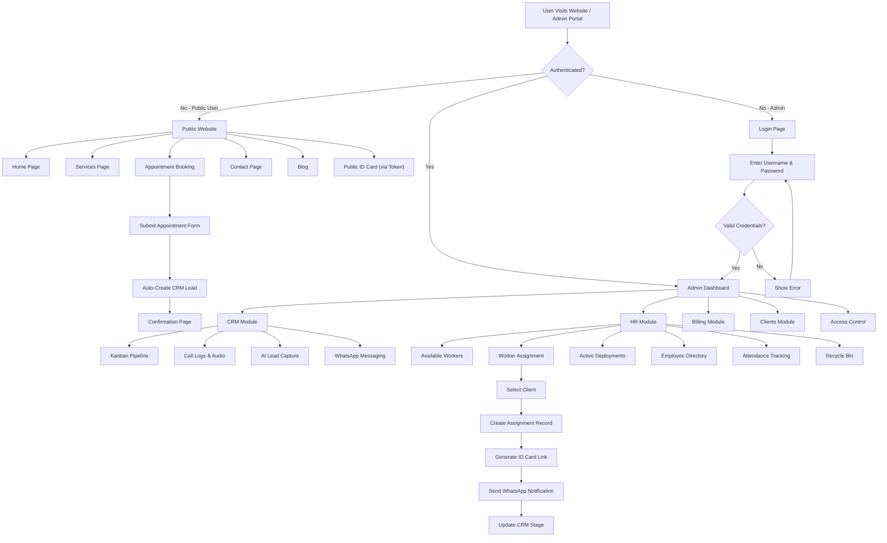

---

## 7.2 Data Flow Diagram — Level 0 (Context Diagram)

The context diagram shows the system as a single process with its external entities:

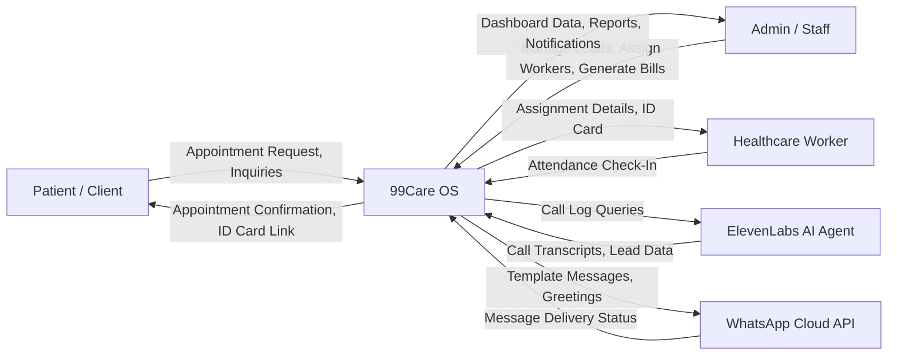

---

## 7.3 Data Flow Diagram — Level 1

The Level 1 DFD breaks the system into its major processes:

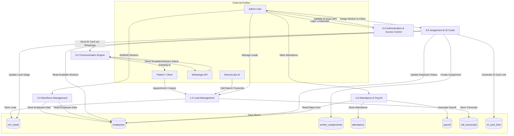

---

## 7.4 Entity Relationship Diagram (ERD)

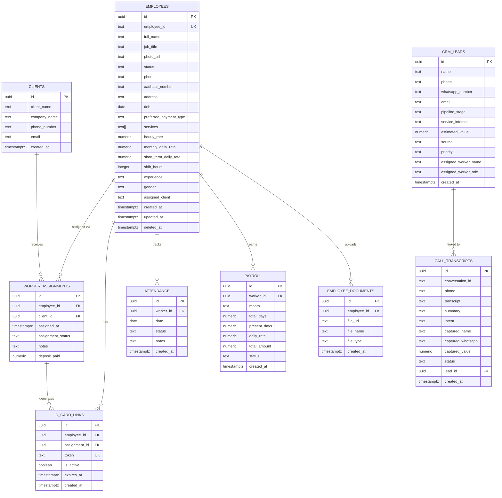

---

## 7.5 Use Case Diagram

```mermaid
flowchart TD
    subgraph Actors
        Admin["🧑‍💼 Admin"]
        Client["🏠 Client / Patient"]
        Worker["👩‍⚕️ Healthcare Worker"]
        AI["🤖 AI Voice Agent"]
    end

    subgraph UseCases["99Care OS — Use Cases"]
        UC1["Login / Authenticate"]
        UC2["View Dashboard"]
        UC3["Manage CRM Pipeline"]
        UC4["View Call Logs"]
        UC5["Send WhatsApp Greeting"]
        UC6["Add Lead to Pipeline"]
        UC7["Add New Employee"]
        UC8["Assign Worker to Client"]
        UC9["Generate Digital ID Card"]
        UC10["Track Attendance"]
        UC11["Calculate Payroll"]
        UC12["Manage Access Control"]
        UC13["Book Appointment Online"]
        UC14["View Public ID Card"]
        UC15["Handle Inbound Call"]
        UC16["Auto-Capture Lead Data"]
        UC17["Release Worker from Client"]
        UC18["Manage Recycle Bin"]
        UC19["Generate Invoice PDF"]
        UC20["Browse Services"]
    end

    Admin --> UC1
    Admin --> UC2
    Admin --> UC3
    Admin --> UC4
    Admin --> UC5
    Admin --> UC6
    Admin --> UC7
    Admin --> UC8
    Admin --> UC9
    Admin --> UC10
    Admin --> UC11
    Admin --> UC12
    Admin --> UC17
    Admin --> UC18
    Admin --> UC19

    Client --> UC13
    Client --> UC14
    Client --> UC20

    Worker --> UC14

    AI --> UC15
    AI --> UC16
```

---

## 7.6 Class Diagram

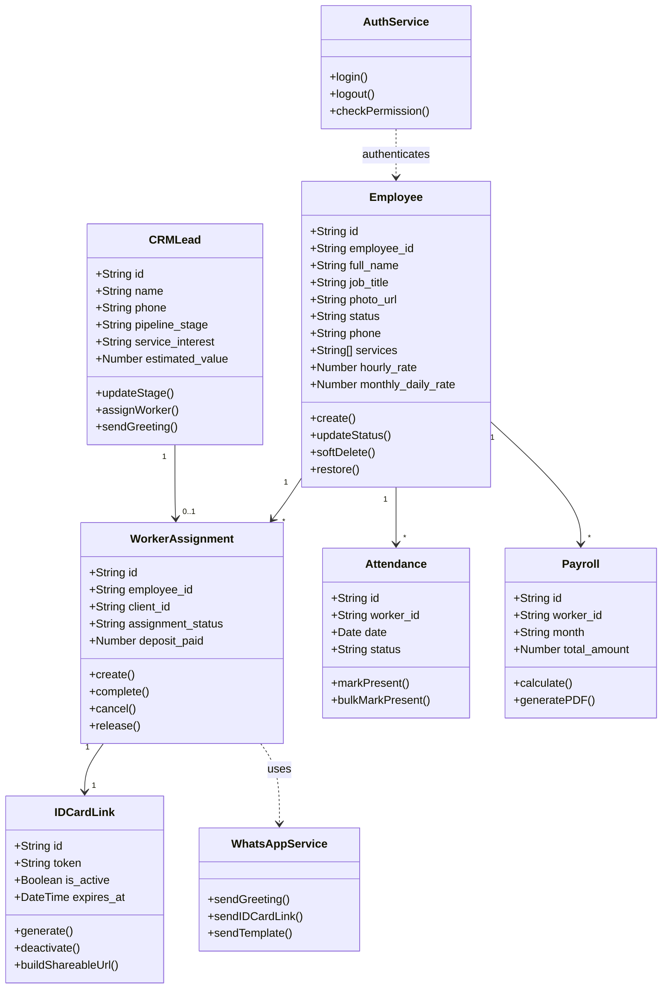

---

## 7.7 Sequence Diagram — Lead Intake Flow (AI Voice Call)

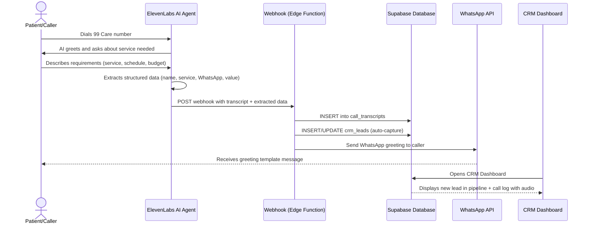

---

## 7.8 Sequence Diagram — Worker Assignment Flow

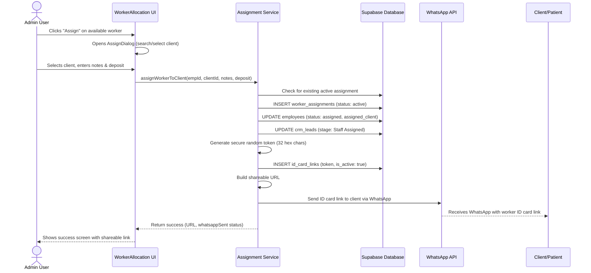

---


# CHAPTER 8: FRONT-END SCREENS

This chapter presents the key user interface screens of the 99Care OS system. Each screen is described with its purpose, key elements, and navigation context.

> **Note:** Screenshots of the actual running application should be inserted in place of the placeholders below. Capture these from the live system at `http://localhost:5173` (OS mode) and `http://localhost:5174` (public website mode).

---

## 8.1 Public Website — Home Page

**Purpose:** The landing page of the 99care.org public website. It serves as the first point of contact for potential clients and provides an overview of 99 Care's services.

**Key Elements:**
- Hero section with a prominent call-to-action ("Book Appointment")
- Service highlights (Elderly Care, Nursing, Baby Care, Physiotherapy, etc.)
- Statistics section (years of experience, happy patients, healthcare workers)
- Testimonials carousel
- WhatsApp chat widget for instant communication
- Responsive navigation with mobile hamburger menu

**Navigation:** Accessible at the root URL (`/`). Links to Services, About, Contact, and Appointment pages.

`[INSERT SCREENSHOT: Home Page — Full view]`

---

## 8.2 Public Website — Services Page

**Purpose:** Displays all healthcare services offered by 99 Care with descriptions and icons.

**Key Elements:**
- Grid of service cards with icons, titles, and brief descriptions
- Each card links to a detailed service page
- Animated entrance effects using Framer Motion

`[INSERT SCREENSHOT: Services Page]`

---

## 8.3 Public Website — Appointment Booking

**Purpose:** Allows potential clients to book an appointment online, which automatically creates a lead in the CRM pipeline.

**Key Elements:**
- Multi-field form: Name, Phone, Email, Service Type, Preferred Date/Time, Message
- Form validation with error messages
- Success confirmation page after submission
- Auto-triggers CRM lead creation via Supabase

`[INSERT SCREENSHOT: Appointment Booking Form]`

---

## 8.4 Login Screen

**Purpose:** Secure authentication gateway for admin and staff users.

**Key Elements:**
- Clean, centered card design with 99Care logo
- Username and password fields with validation
- Loading state with spinner during authentication
- Error message display for invalid credentials
- Responsive design for mobile and desktop

`[INSERT SCREENSHOT: Login Screen]`

---

## 8.5 Admin Dashboard

**Purpose:** The main landing page after login, providing a high-level overview of business metrics.

**Key Elements:**
- Summary cards (total leads, active workers, pending assignments, revenue)
- Quick-access navigation to all modules
- Recent activity feed
- Sidebar navigation with module icons (CRM, HR, Clients, Billing, Settings)

`[INSERT SCREENSHOT: Admin Dashboard]`

---

## 8.6 CRM — Kanban Pipeline View

**Purpose:** Visual pipeline management for tracking leads through various stages.

**Key Elements:**
- Draggable lead cards organized in columns by pipeline stage
- Stages: New Inquiry → Form Submitted → Staff Assigned → Deposit Pending → Trial in Progress → Active Client
- Each card displays lead name, phone, estimated value, and assigned worker badge
- Right-side inspector panel for lead details and actions
- Search and filter functionality

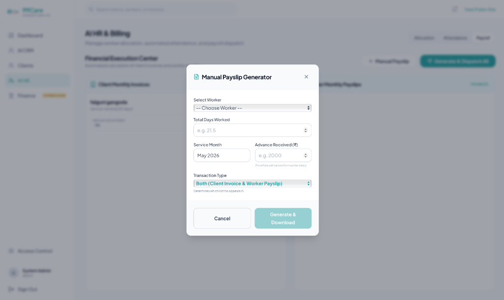

---

## 8.7 CRM — Call Logs with AI Summary

**Purpose:** Displays AI-processed call recordings with transcripts and auto-captured lead data.

**Key Elements:**
- Call entries with caller name, type (Inbound/Outbound), duration, and timestamp
- Audio player for call playback
- AI-generated summary and detected intent
- "Lead Data Captured" section showing name, estimated value, phone number, and WhatsApp number
- "Send Greeting" and "Add to Pipeline" action buttons
- "View Full Transcript" button for complete call transcript modal

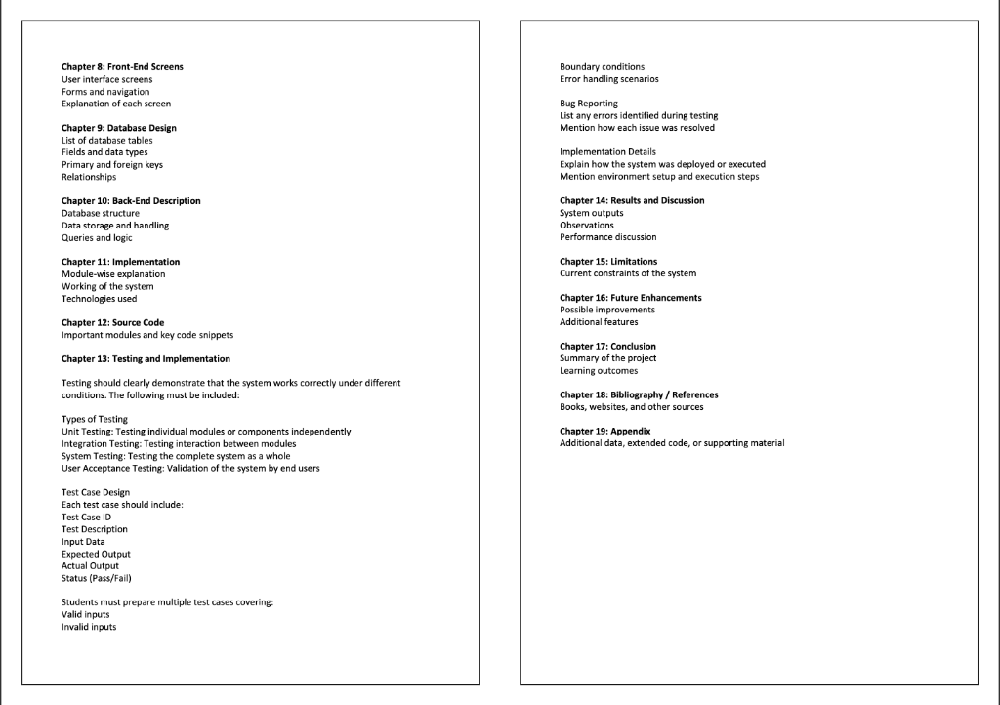

---

## 8.8 HR — Available Workers Tab

**Purpose:** Displays all healthcare workers currently available for assignment.

**Key Elements:**
- Card-based grid layout with worker photo, name, job title, and availability status
- Service tags and payment type indicators
- "Assign" and "ID Card" action buttons on each card
- Search bar and refresh button
- Dropdown menu with Full Profile, Preview ID Card, Edit, and Delete options

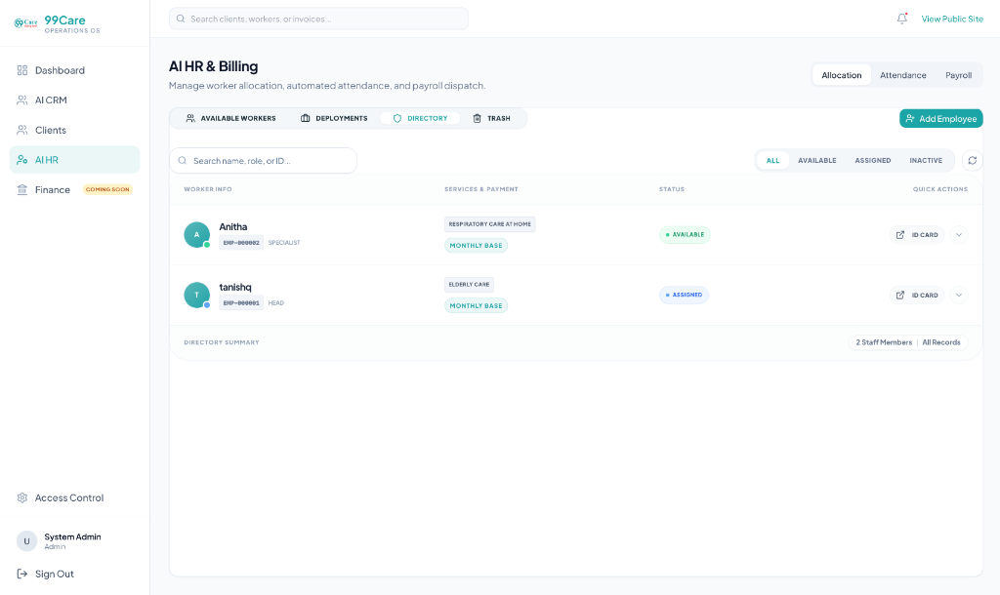

---

## 8.9 HR — Active Deployments Tab

**Purpose:** Shows all currently active worker-to-client assignments.

**Key Elements:**
- Table view with columns: Staff Member, ID No., Client Name, Deployment Date, Auth Link, Actions
- Actions: ID Card preview, Resend Link (WhatsApp), Release worker, Terminate assignment
- Release action includes an inline confirmation prompt
- Shareable link with copy button and external link

`[INSERT SCREENSHOT: Active Deployments Table]`

---

## 8.10 HR — Employee Directory

**Purpose:** Complete directory of all employees (available, assigned, inactive) with status management.

**Key Elements:**
- Table view with worker info, services & payment type, status badge, and quick actions
- Status filter tabs (All, Available, Assigned, Inactive)
- Status dropdown menu for changing worker status
- Confirmation dialog when moving from "Assigned" to "Available" (safety warning)
- Click-to-view full profile details
- Directory summary footer

`[INSERT SCREENSHOT: Employee Directory Table]`

---

## 8.11 HR — Attendance Matrix

**Purpose:** Daily attendance tracking for all active/assigned workers.

**Key Elements:**
- Date picker with max date constraint (today)
- Stats header showing Total, Present, Leaves/Absent, and Pending counts
- Linear list of workers with name, role, assigned client, and attendance status selector
- Status options: Present, Absent, Paid Leave, Unpaid Leave, Half Day, Weekly Off
- "Bulk Mark Present" button for quick batch operations

`[INSERT SCREENSHOT: Attendance Matrix]`

---

## 8.12 HR — Worker Assignment Dialog

**Purpose:** Modal dialog for assigning a worker to a client.

**Key Elements:**
- Employee info card with photo, name, job title, and employee ID
- Client search field with dropdown (searches CRM leads by name)
- Pipeline stage badge next to each client result
- Inline "Add New Client" form
- Notes textarea and deposit amount input
- Success screen showing shareable ID card link and WhatsApp status

`[INSERT SCREENSHOT: Assignment Dialog]`

---

## 8.13 HR — Digital ID Card Preview

**Purpose:** Preview of the digital employee ID card that gets shared with clients.

**Key Elements:**
- Professional ID card design with 99 Care branding
- Employee photo, name, designation, employee ID
- Personal details (Aadhaar, DOB, address, experience, gender)
- QR code or verification section
- Print/Save button for physical copy generation

`[INSERT SCREENSHOT: ID Card Preview Dialog]`

---

## 8.14 Billing Module

**Purpose:** Financial management including payroll calculation and invoice generation.

**Key Elements:**
- Payroll table with worker names, present days, rate, and total amount
- Month selector for viewing different pay periods
- PDF export button for invoice generation
- Summary cards for total payroll amount

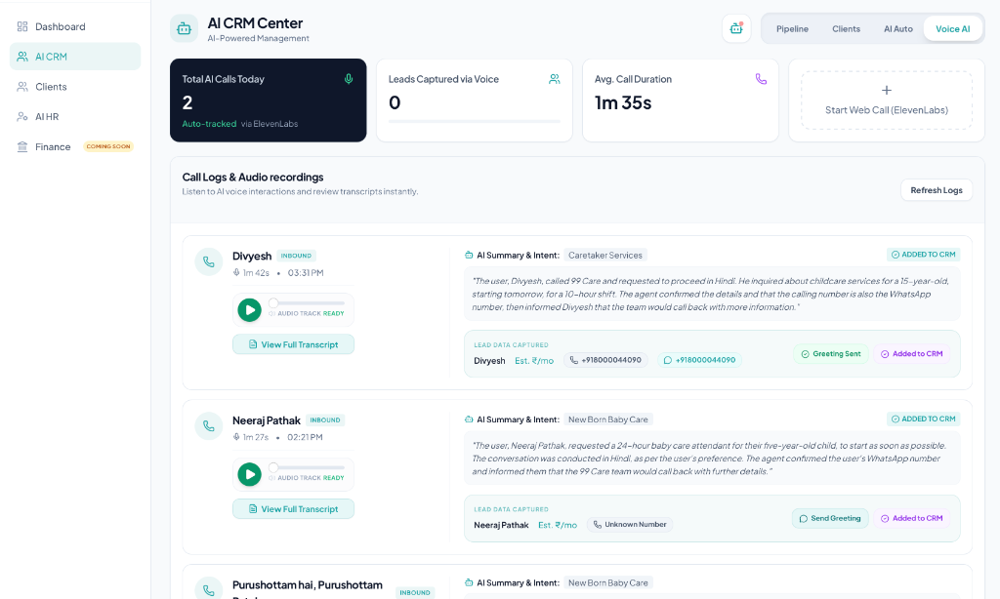

---

## 8.15 Access Control / Settings

**Purpose:** Role-based access management for staff accounts.

**Key Elements:**
- Staff member list with name, role, email, and permissions
- Add new staff member form
- Module-level permission toggles (CRM, HR, Clients, Finance)
- Edit and delete actions

`[INSERT SCREENSHOT: Access Control Page]`

---


# CHAPTER 9: DATABASE DESIGN

## 9.1 Overview

The 99Care OS system uses **PostgreSQL 15** as its relational database, managed through **Supabase**. The database is designed with the following principles:

- **UUID Primary Keys**: All tables use UUID-based primary keys for globally unique identification and security.
- **Referential Integrity**: Foreign key constraints enforce relationships between tables.
- **Soft Delete**: Employee records support soft deletion via a `deleted_at` timestamp column.
- **Auto-Generated IDs**: Employee IDs (e.g., EMP-000001) are auto-generated by database triggers.
- **Row Level Security (RLS)**: All tables have RLS policies that restrict access to authenticated users.
- **Timestamps**: All tables include `created_at` and `updated_at` fields for audit trails.

---

## 9.2 List of Database Tables

| # | Table Name | Purpose |
|---|-----------|---------|
| 1 | `employees` | Stores healthcare worker profiles and details |
| 2 | `crm_leads` | Stores lead/prospect information for the CRM pipeline |
| 3 | `worker_assignments` | Junction table linking employees to clients for job assignments |
| 4 | `id_card_links` | Stores shareable public-access tokens for digital ID cards |
| 5 | `clients` | Client records for worker assignment and WhatsApp notifications |
| 6 | `attendance` | Daily attendance records for healthcare workers |
| 7 | `payroll` | Monthly payroll calculation records |
| 8 | `call_transcripts` | AI voice call transcripts and extracted lead data |
| 9 | `employee_documents` | Uploaded ID proofs and documents for employees |
| 10 | `appointments` | Online appointment bookings from the public website |

---

## 9.3 Table Structures

### Table 9.1: `employees`

| Column | Data Type | Constraints | Description |
|--------|----------|-------------|-------------|
| id | UUID | PK, DEFAULT gen_random_uuid() | Primary key |
| employee_id | TEXT | UNIQUE, NOT NULL | Auto-generated (EMP-000001 format) |
| full_name | TEXT | NOT NULL | Full name of the employee |
| job_title | TEXT | NOT NULL | Job title / designation |
| photo_url | TEXT | | Supabase Storage URL for profile photo |
| department | TEXT | | Department (optional) |
| status | TEXT | NOT NULL, DEFAULT 'available', CHECK | Status: available, assigned, inactive |
| phone | TEXT | | Contact phone number |
| aadhaar_number | TEXT | | Aadhaar card number |
| address | TEXT | | Residential address |
| dob | DATE | | Date of birth |
| preferred_payment_type | TEXT | DEFAULT 'monthly' | Payment type: hourly, monthly, short_term |
| services | TEXT[] | | Array of service skills |
| hourly_rate | NUMERIC | DEFAULT 0 | Hourly payment rate |
| monthly_daily_rate | NUMERIC | DEFAULT 0 | Daily rate for monthly workers |
| short_term_daily_rate | NUMERIC | DEFAULT 0 | Daily rate for short-term workers |
| shift_hours | INTEGER | | Shift duration in hours (for hourly workers) |
| rating | NUMERIC | DEFAULT 5.0 | Worker rating |
| experience | TEXT | | Experience description |
| gender | TEXT | | Gender |
| assigned_client | TEXT | | Name of currently assigned client (denormalized) |
| username | TEXT | UNIQUE (partial, WHERE NOT NULL) | Optional login username |
| password_hash | TEXT | | Hashed password for worker login |
| deposit_received | NUMERIC | DEFAULT 0 | Deposit amount received |
| created_at | TIMESTAMPTZ | NOT NULL, DEFAULT now() | Record creation timestamp |
| updated_at | TIMESTAMPTZ | NOT NULL, DEFAULT now() | Last update timestamp |
| deleted_at | TIMESTAMPTZ | | Soft-delete timestamp (NULL = active) |

**Primary Key:** `id`
**Unique Constraints:** `employee_id`, `username` (partial, WHERE NOT NULL)

---

### Table 9.2: `crm_leads`

| Column | Data Type | Constraints | Description |
|--------|----------|-------------|-------------|
| id | UUID | PK, DEFAULT gen_random_uuid() | Primary key |
| name | TEXT | NOT NULL | Lead/prospect name |
| phone | TEXT | | Primary phone number |
| whatsapp_number | TEXT | | WhatsApp contact number |
| email | TEXT | | Email address |
| pipeline_stage | TEXT | NOT NULL, DEFAULT 'New Inquiry' | Current pipeline stage |
| service_interest | TEXT | | Service they are interested in |
| estimated_value | NUMERIC | | Estimated monthly value |
| source | TEXT | | Lead source (Call, Website, WhatsApp, Manual) |
| priority | TEXT | DEFAULT 'medium' | Lead priority level |
| notes | TEXT | | Additional notes |
| assigned_worker_name | TEXT | | Denormalized assigned worker name |
| assigned_worker_role | TEXT | | Denormalized assigned worker job title |
| automation_error | TEXT | | Automation status/error tracking |
| created_at | TIMESTAMPTZ | NOT NULL, DEFAULT now() | Record creation timestamp |

**Primary Key:** `id`

---

### Table 9.3: `worker_assignments`

| Column | Data Type | Constraints | Description |
|--------|----------|-------------|-------------|
| id | UUID | PK, DEFAULT gen_random_uuid() | Primary key |
| employee_id | UUID | FK → employees(id), ON DELETE CASCADE | Assigned employee |
| client_id | UUID | FK → clients(id), ON DELETE CASCADE | Assigned client |
| assigned_at | TIMESTAMPTZ | NOT NULL, DEFAULT now() | Assignment date/time |
| assignment_status | TEXT | NOT NULL, DEFAULT 'active', CHECK | Status: active, completed, cancelled |
| notes | TEXT | | Assignment notes |
| deposit_paid | NUMERIC | DEFAULT 0 | Deposit amount paid by client |

**Primary Key:** `id`
**Foreign Keys:** `employee_id` → `employees(id)`, `client_id` → `clients(id)`

---

### Table 9.4: `id_card_links`

| Column | Data Type | Constraints | Description |
|--------|----------|-------------|-------------|
| id | UUID | PK, DEFAULT gen_random_uuid() | Primary key |
| employee_id | UUID | FK → employees(id), ON DELETE CASCADE | Employee this ID card belongs to |
| assignment_id | UUID | FK → worker_assignments(id), ON DELETE CASCADE | Related assignment |
| token | TEXT | UNIQUE, NOT NULL | Secure random token for public URL |
| is_active | BOOLEAN | NOT NULL, DEFAULT true | Whether the link is currently active |
| expires_at | TIMESTAMPTZ | | Expiration timestamp (NULL = never expires) |
| created_at | TIMESTAMPTZ | NOT NULL, DEFAULT now() | Creation timestamp |

**Primary Key:** `id`
**Foreign Keys:** `employee_id` → `employees(id)`, `assignment_id` → `worker_assignments(id)`

---

### Table 9.5: `clients`

| Column | Data Type | Constraints | Description |
|--------|----------|-------------|-------------|
| id | UUID | PK, DEFAULT gen_random_uuid() | Primary key |
| client_name | TEXT | NOT NULL | Client/patient name |
| company_name | TEXT | | Company or facility name |
| phone_number | TEXT | | Phone number for WhatsApp notifications |
| email | TEXT | | Email address |
| created_at | TIMESTAMPTZ | NOT NULL, DEFAULT now() | Record creation timestamp |

**Primary Key:** `id`

---

### Table 9.6: `attendance`

| Column | Data Type | Constraints | Description |
|--------|----------|-------------|-------------|
| id | UUID | PK, DEFAULT gen_random_uuid() | Primary key |
| worker_id | UUID | FK → employees(id) | Employee reference |
| date | DATE | NOT NULL | Attendance date |
| status | TEXT | NOT NULL | Status: Present, Absent, Paid Leave, Unpaid Leave, Half Day, Weekly Off |
| notes | TEXT | | Additional remarks |
| created_at | TIMESTAMPTZ | DEFAULT now() | Record creation timestamp |

**Primary Key:** `id`
**Foreign Keys:** `worker_id` → `employees(id)`
**Unique Constraint:** (`worker_id`, `date`) — one record per worker per day

---

### Table 9.7: `payroll`

| Column | Data Type | Constraints | Description |
|--------|----------|-------------|-------------|
| id | UUID | PK, DEFAULT gen_random_uuid() | Primary key |
| worker_id | UUID | FK → employees(id) | Employee reference |
| month | TEXT | NOT NULL | Pay period (e.g., "2026-04") |
| total_days | NUMERIC | | Total working days in the month |
| present_days | NUMERIC | | Days marked present |
| daily_rate | NUMERIC | | Applicable daily rate |
| total_amount | NUMERIC | | Calculated total payroll amount |
| status | TEXT | DEFAULT 'pending' | Payroll status: pending, paid |
| created_at | TIMESTAMPTZ | DEFAULT now() | Record creation timestamp |

**Primary Key:** `id`
**Foreign Keys:** `worker_id` → `employees(id)`

---

### Table 9.8: `call_transcripts`

| Column | Data Type | Constraints | Description |
|--------|----------|-------------|-------------|
| id | UUID | PK, DEFAULT gen_random_uuid() | Primary key |
| conversation_id | TEXT | UNIQUE | ElevenLabs conversation ID |
| phone | TEXT | | Caller's phone number |
| transcript | TEXT | | Full call transcript |
| summary | TEXT | | AI-generated call summary |
| intent | TEXT | | Detected service intent |
| captured_name | TEXT | | Extracted caller name |
| captured_whatsapp | TEXT | | Extracted WhatsApp number |
| captured_value | NUMERIC | | Extracted estimated value |
| status | TEXT | DEFAULT 'New' | Processing status |
| automation_error | TEXT | | Automation status tracking |
| lead_id | UUID | FK → crm_leads(id) | Linked CRM lead |
| created_at | TIMESTAMPTZ | DEFAULT now() | Record creation timestamp |

**Primary Key:** `id`

---

## 9.4 Relationships Summary

| Relationship | Type | Description |
|-------------|------|-------------|
| employees → worker_assignments | One-to-Many | One employee can have multiple assignments (over time) |
| clients → worker_assignments | One-to-Many | One client can have multiple worker assignments |
| worker_assignments → id_card_links | One-to-Many | Each assignment generates at least one ID card link |
| employees → id_card_links | One-to-Many | An employee can have multiple ID card links across assignments |
| employees → attendance | One-to-Many | One employee has daily attendance records |
| employees → payroll | One-to-Many | One employee has monthly payroll records |
| employees → employee_documents | One-to-Many | One employee can have multiple uploaded documents |
| crm_leads → call_transcripts | One-to-Many | A lead can be linked to multiple call transcripts |

---


# CHAPTER 10: BACK-END DESCRIPTION

## 10.1 Database Structure

The backend of 99Care OS is built on **Supabase**, an open-source Backend-as-a-Service (BaaS) platform that provides a managed **PostgreSQL 15** database, authentication, file storage, real-time subscriptions, and serverless edge functions — all accessible through auto-generated REST and GraphQL APIs.

### Architecture Overview

```
┌──────────────────────────────────────────────────────┐
│                   CLIENT (Browser)                    │
│            React 19 + TypeScript + Vite               │
└──────────────┬───────────────────────┬────────────────┘
               │ REST API (HTTPS)      │ Realtime (WS)
               ▼                       ▼
┌──────────────────────────────────────────────────────┐
│                   SUPABASE PLATFORM                   │
│  ┌────────────┐ ┌──────────┐ ┌───────────────────┐   │
│  │  PostgREST │ │ GoTrue   │ │ Supabase Storage  │   │
│  │  (REST API)│ │  (Auth)  │ │ (S3-compatible)   │   │
│  └─────┬──────┘ └────┬─────┘ └────────┬──────────┘   │
│        │              │                │              │
│        ▼              ▼                ▼              │
│  ┌──────────────────────────────────────────────┐     │
│  │          PostgreSQL 15 Database              │     │
│  │  ┌──────────┐ ┌──────────┐ ┌──────────────┐  │     │
│  │  │employees │ │crm_leads │ │worker_assign.│  │     │
│  │  │attendance│ │payroll   │ │id_card_links │  │     │
│  │  │clients   │ │call_trans│ │emp_documents │  │     │
│  │  └──────────┘ └──────────┘ └──────────────┘  │     │
│  │       Row Level Security (RLS) Policies      │     │
│  └──────────────────────────────────────────────┘     │
│                                                       │
│  ┌──────────────────────────────────────────────┐     │
│  │       Supabase Edge Functions (Deno)         │     │
│  │  • elevenlabs-call-webhook                   │     │
│  │  • meta-whatsapp-outbound                    │     │
│  │  • send-id-card-link                         │     │
│  │  • get-call-audio                            │     │
│  │  • get-elevenlabs-calls                      │     │
│  │  • send-contact-email                        │     │
│  │  • razorpay-webhook                          │     │
│  │  • drip-campaign                             │     │
│  │  • status-engine                             │     │
│  └──────────────────────────────────────────────┘     │
└──────────────────────────────────────────────────────┘
               │                       │
               ▼                       ▼
┌──────────────────┐    ┌──────────────────────────┐
│  ElevenLabs AI   │    │ Meta WhatsApp Cloud API  │
│  (Voice Agent)   │    │  (Messaging Platform)    │
└──────────────────┘    └──────────────────────────┘
```

---

## 10.2 Data Storage and Handling

### 10.2.1 Database (PostgreSQL via Supabase)

All structured data is stored in a PostgreSQL 15 relational database managed by Supabase. The key aspects of data handling include:

- **Auto-generated UUIDs**: All records use `gen_random_uuid()` for primary keys, ensuring globally unique and non-sequential identifiers.
- **Database Triggers**: Custom PostgreSQL triggers handle automatic operations:
  - `generate_employee_id_trigger`: Auto-generates sequential employee IDs in the format `EMP-000001` upon insertion into the `employees` table.
  - `set_updated_at_trigger`: Automatically updates the `updated_at` column whenever a record is modified.
- **Soft Deletion**: Employee records use a `deleted_at` column for soft deletion, allowing recovery from the recycle bin.
- **Check Constraints**: Status fields use CHECK constraints to enforce valid values (e.g., `status IN ('available', 'assigned', 'inactive')`).

### 10.2.2 File Storage (Supabase Storage)

Binary files are stored in Supabase Storage, an S3-compatible object storage service:

- **`employee-photos` bucket**: Stores employee profile photographs. Files are uploaded with unique random names under the `photos/` directory.
- **`employee-photos/documents/` path**: Stores scanned ID proofs and certificates uploaded during employee onboarding, organized by employee UUID.
- **Public URLs**: Uploaded files are served via auto-generated public URLs for display in the application.

### 10.2.3 Authentication Data

User authentication is managed by **GoTrue** (Supabase Auth):

- **Virtual Email Strategy**: Admin usernames are mapped to virtual email addresses (e.g., `admin` → `admin@staff.healthcare`) to work with Supabase's email-based auth system.
- **JWT Tokens**: Successful authentication returns a JWT token that is stored in the browser and sent with every API request.
- **Session Management**: Supabase's client library handles automatic session refresh and token renewal.

---

## 10.3 Queries and Logic

### 10.3.1 Supabase Edge Functions

Edge Functions are serverless TypeScript functions that run on the Deno runtime at the edge (close to users). They handle external API integrations and webhook processing:

| Edge Function | Purpose | Trigger |
|---------------|---------|---------|
| `elevenlabs-call-webhook` | Receives call completion webhooks from ElevenLabs AI, extracts transcript/summary/lead data, and inserts into `call_transcripts` table. Auto-creates CRM lead. | HTTP POST (webhook from ElevenLabs) |
| `get-elevenlabs-calls` | Fetches call history from ElevenLabs API and syncs with local database. Returns enriched call data. | HTTP GET (from CRM dashboard) |
| `get-call-audio` | Proxies audio file requests to ElevenLabs API. Streams the call recording audio to the browser audio player. | HTTP GET (from audio player component) |
| `meta-whatsapp-outbound` | Sends WhatsApp template messages via Meta's Cloud API. Handles greeting messages, follow-ups, and notifications. | HTTP POST (from CRM module) |
| `send-id-card-link` | Sends the digital ID card shareable link to a client via WhatsApp. Formats the message with employee name, job title, and URL. | HTTP POST (from assignment service) |
| `send-contact-email` | Processes contact form submissions from the public website and sends notification emails. | HTTP POST (from contact page) |
| `razorpay-webhook` | Handles payment confirmation webhooks from Razorpay payment gateway. | HTTP POST (webhook from Razorpay) |
| `drip-campaign` | Manages scheduled follow-up message sequences for leads in the pipeline. | Scheduled / HTTP POST |
| `status-engine` | Processes automated pipeline stage transitions based on business rules. | HTTP POST |
| `send-joining-link` | Sends onboarding/joining links to newly assigned healthcare workers. | HTTP POST |
| `resend-email` | Handles email resend operations for various system notifications. | HTTP POST |
| `whatsapp-elevenlabs-bot` | Handles inbound WhatsApp messages and routes them to the AI conversational agent for automated responses. | HTTP POST (webhook from Meta WhatsApp) |

### 10.3.2 Key Database Queries

The application communicates with the database through Supabase's JavaScript client library (`@supabase/supabase-js`), which translates method calls into REST API requests. Key query patterns include:

**1. Fetching Available Employees (with filters)**
```
supabase.from('employees')
  .select('*')
  .eq('status', 'available')
  .is('assigned_client', null)
  .is('deleted_at', null)
  .order('full_name', { ascending: true })
```

**2. Creating a Worker Assignment (with compensation)**
```
Step 1: INSERT into worker_assignments
Step 2: UPDATE employees SET status = 'assigned'
Step 3: UPDATE crm_leads SET pipeline_stage = 'Staff Assigned'
Step 4: INSERT into id_card_links (generate secure token)
Step 5: INVOKE send-id-card-link Edge Function
```

**3. Releasing a Worker (with full cleanup)**
```
Step 1: UPDATE id_card_links SET is_active = false
Step 2: UPDATE worker_assignments SET assignment_status = 'cancelled'
Step 3: UPDATE employees SET status = 'available', assigned_client = null
Step 4: UPDATE crm_leads SET assigned_worker_name = null
```

**4. Attendance Marking (Upsert)**
```
supabase.from('attendance')
  .upsert({ worker_id, date, status })
  .select()
```

### 10.3.3 Row Level Security (RLS)

All tables have RLS policies that ensure data isolation and access control:

- **Authenticated users only**: All SELECT, INSERT, UPDATE, and DELETE operations require a valid JWT token.
- **Public access**: The `id_card_links` table allows anonymous SELECT access for token-based public ID card viewing.
- **Service role bypass**: Edge Functions use the `service_role` key to bypass RLS when performing system-level operations (e.g., webhook processing).

---


# CHAPTER 11: IMPLEMENTATION

## 11.1 Module-Wise Explanation

The 99Care OS system is organized into six major modules, each responsible for a distinct area of the healthcare operations workflow.

### Module A: Public Website

The public-facing website serves as the digital storefront for 99 Care. It is built as a set of React pages wrapped in a shared `Layout` component that provides consistent navigation and footer.

**Key Pages:**
- **HomePage** — Hero section, service highlights, statistics, testimonials, and a WhatsApp chat widget
- **ServicesPage** — Grid of all healthcare services with animated entrance effects
- **ServiceDetailPage** — Detailed service descriptions with booking call-to-action
- **AppointmentPage** — Multi-field booking form with Zod validation; on submission, it creates a record in the `appointments` table and auto-triggers a CRM lead creation via a database trigger
- **ContactPage** — Contact form that invokes the `send-contact-email` Edge Function
- **BlogPage / BlogDetailPage** — Blog listing and detail pages for SEO and content marketing
- **PublicIDCard** — Token-authenticated page that displays a worker's digital ID card to clients for identity verification

**Technical Highlights:**
- All pages use Framer Motion for smooth page transitions and scroll-based animations
- SEO meta tags are dynamically set per page using the `SEOMeta` component
- The website is configured as a PWA with service worker caching for offline access
- Responsive design using TailwindCSS utility classes, tested across mobile, tablet, and desktop

---

### Module B: CRM (Customer Relationship Management)

The CRM module is the lead management hub, integrating AI voice calls and WhatsApp messaging into a visual pipeline.

**Sub-Features:**

1. **Kanban Pipeline Board**
   - Visual drag-and-drop interface with configurable stages: New Inquiry → Form Submitted → Staff Assigned → Deposit Pending → Trial in Progress → Active Client
   - Each lead card shows name, phone, estimated value, service interest, and assigned worker badge
   - Right-side inspector panel for viewing lead details, changing stage, editing values, and triggering AI follow-ups

2. **Call Logs & Audio**
   - Fetches call data from ElevenLabs via the `get-elevenlabs-calls` Edge Function
   - Displays call entries with caller name, type (Inbound/Outbound), duration, timestamp
   - Embedded audio player streams call recordings via the `get-call-audio` Edge Function
   - AI-generated summary and detected intent displayed alongside each call
   - "View Full Transcript" modal shows the complete conversation

3. **AI Lead Capture**
   - The `elevenlabs-call-webhook` Edge Function processes incoming call data
   - Extracts structured information: caller name, service interest, estimated value, WhatsApp number
   - Automatically creates a CRM lead in the pipeline
   - Links the call transcript to the created lead

4. **WhatsApp Integration**
   - Automated greeting messages sent to new leads via the `meta-whatsapp-outbound` Edge Function
   - Template-based messages following Meta's WhatsApp Business API requirements
   - Status tracking: Sending → Sent → Error with retry functionality
   - Phone number normalization (handling +91/91 prefix variations)

---

### Module C: HR / Workforce Management

The HR module is the largest and most complex module, handling the complete employee lifecycle.

**Sub-Features:**

1. **Employee Onboarding** (`Add New Employee` dialog)
   - Multi-field form: Name, Job Title, Photo, Phone, Aadhaar, Address, DOB, Gender, Experience
   - Service selection (multi-select): Elderly Care, Nursing, Baby Care, Physiotherapy, etc.
   - Payment configuration: Hourly/Monthly/Short-Term with corresponding rate inputs
   - Document upload: Multiple ID proofs stored via Supabase Storage
   - Photo upload with preview and crop support

2. **Available Workers Tab**
   - Card-based grid showing workers with `status = 'available'`
   - Each card displays photo, name, job title, service tags, and payment type
   - Actions: Assign (opens assignment dialog), Preview ID Card, Edit, Delete
   - Search bar with debounced input for filtering

3. **Worker Assignment Flow** (`assignWorkerToClient` service)
   - Step 1: Validate no existing active assignment for the client (single-staff rule)
   - Step 2: Create `worker_assignments` record with status 'active'
   - Step 3: Update employee status to 'assigned' and set `assigned_client`
   - Step 4: Update CRM lead stage to 'Staff Assigned'
   - Step 5: Generate cryptographically secure token (32 hex chars via `crypto.randomUUID`)
   - Step 6: Create `id_card_links` record with the token
   - Step 7: Send WhatsApp message to client with shareable ID card link
   - Compensation logic: If any step fails, previous steps are rolled back

4. **Active Deployments Tab**
   - Table view of all active worker-to-client assignments
   - Actions: Preview ID Card, Resend WhatsApp Link, Release Worker, Terminate Assignment
   - Release flow calls `deactivateIDCardLink` which handles full cleanup

5. **Employee Directory**
   - Full table view of all employees (excluding soft-deleted)
   - Status filter tabs: All, Available, Assigned, Inactive
   - Status change dropdown with safety confirmation dialog for "Assigned → Available" transitions
   - Confirmation warns about releasing the worker from their current client assignment

6. **Attendance Tracking**
   - Date-picker constrained to past/today dates
   - Lists all available/assigned workers for the selected date
   - Status options: Present, Absent, Paid Leave, Unpaid Leave, Half Day, Weekly Off
   - Bulk "Mark All Present" for quick daily operations
   - Stats header: Total, Present, Leave/Absent, Pending

7. **Digital ID Card Generation**
   - Professional card design with 99 Care branding, employee photo, name, designation, ID number
   - Shareable via unique token-based public URL
   - Download as image functionality using html2canvas
   - Print-ready layout

8. **Recycle Bin**
   - Soft-deleted employees shown in a separate tab
   - Restore individual employees
   - Permanent delete with full cascade cleanup (assignments, ID cards, attendance, payroll, documents)
   - "Empty Trash" for bulk permanent deletion

---

### Module D: Client Management

- **Client Master Database** displaying all clients with contact information
- Auto-populated from CRM leads when a worker is assigned
- Phone number display and WhatsApp contact integration
- Assignment history tracking per client

---

### Module E: Billing & Finance

- **Payroll Calculation** based on attendance records and configured payment rates
- Monthly payroll summary with worker-wise breakdown
- Support for multiple rate structures (hourly × shift hours, daily rate × present days)
- PDF invoice generation using jsPDF with autoTable for formatted output
- Export and print functionality

---

### Module F: Access Control & Authentication

- **Role-Based Access Control (RBAC)**: Administrators can create staff accounts with specific module-level permissions
- Module toggles: CRM, HR, Clients, Finance — each can be individually enabled/disabled per user
- Staff account management: Create, Edit, Delete accounts
- Virtual email authentication strategy (username → `username@staff.healthcare`)
- Protected routes check permissions before rendering module content

---

## 11.2 Working of the System

The system follows a client-server architecture where the React frontend communicates with the Supabase backend through REST APIs:

1. **User opens the application** → React Router determines the route and renders the appropriate component
2. **Authentication check** → `ProtectedRoute` component verifies JWT token and module permissions
3. **Data fetching** → Components use Supabase client library to query the database
4. **User actions** → Form submissions, button clicks trigger service functions that perform multi-step database operations
5. **External integrations** → Edge Functions handle webhook processing (ElevenLabs, WhatsApp) asynchronously
6. **Real-time updates** → Supabase Realtime subscriptions push database changes to connected clients

---

## 11.3 Technologies Used (Summary)

| Layer | Technology | Role |
|-------|-----------|------|
| Frontend | React 19 + TypeScript | Interactive UI components |
| Styling | TailwindCSS 3 | Utility-first CSS framework |
| Components | shadcn/ui (Radix) | Accessible, customizable UI components |
| Build | Vite 7 | Fast development server and production bundler |
| Backend | Supabase | Database, Auth, Storage, Edge Functions |
| Database | PostgreSQL 15 | Relational data storage |
| AI Voice | ElevenLabs | Conversational AI for phone calls |
| Messaging | Meta WhatsApp Cloud API | Automated template messages |
| Hosting | Vercel | Global edge deployment |
| Version Control | Git + GitHub | Source code management |

---


# CHAPTER 12: SOURCE CODE

---

## Non-Disclosure Compliance (NDC) Notice

> **This project is submitted under Non-Disclosure Compliance (NDC) conditions.**
>
> As per the NDC certificate issued by **99 Care** (attached at the beginning of this report), the source code of the 99Care OS system contains **proprietary and confidential business logic, data structures, API integrations, and trade secrets** that cannot be disclosed, reproduced, or published in any part of this project report.

---

### What is Restricted:
- Complete source code listings
- API keys, authentication tokens, and environment configurations
- Proprietary algorithm implementations
- Third-party API integration details (ElevenLabs, Meta WhatsApp Cloud API)
- Database migration scripts containing business logic
- Edge Function implementations

### What is Provided Instead:
1. **Complete Video Demonstration**: A comprehensive video walkthrough of the entire system has been prepared, demonstrating all modules, user flows, and features. This video is submitted alongside this report for evaluation purposes.

2. **System Architecture & Design**: Chapters 7 (System Design), 9 (Database Design), and 10 (Back-End Description) provide detailed architectural documentation including flowcharts, DFDs, ERDs, class diagrams, sequence diagrams, and database schema — all without exposing proprietary code.

3. **Module-Wise Implementation Description**: Chapter 11 (Implementation) provides a thorough module-wise explanation of the system's functionality and working.

4. **Live Demo Availability**: A live demonstration of the working system can be arranged upon request during the viva/evaluation session.

---

### Project Statistics (Non-Confidential)

| Metric | Value |
|--------|-------|
| Total Source Files | 170+ |
| Primary Language | TypeScript / TSX |
| Frontend Components | 40+ React components |
| Backend Edge Functions | 12 serverless functions |
| Database Tables | 10 tables |
| Database Migrations | 27 migration files |
| Lines of Code (Frontend) | ~13,500 |
| Version Control | Git (GitHub — private repository) |
| Deployment | Vercel (dual-deploy: public website + admin portal) |

---


# CHAPTER 13: TESTING AND IMPLEMENTATION

## 13.1 Types of Testing

The 99Care OS system was tested using a combination of testing methodologies to ensure reliability, correctness, and usability across all modules.

### 13.1.1 Unit Testing
Individual components, service functions, and utility modules were tested in isolation to verify that each unit of code performs its intended function correctly.

**Focus Areas:**
- Employee service functions (create, update, delete, restore)
- Assignment service functions (assign, deactivate, release)
- Phone number normalization utility
- Token generation and URL building functions
- Form validation schemas (Zod)

### 13.1.2 Integration Testing
Interactions between connected modules were tested to verify that data flows correctly across system boundaries.

**Focus Areas:**
- CRM lead creation → Worker assignment → ID card generation → WhatsApp notification (end-to-end assignment flow)
- AI call webhook → Call transcript storage → CRM lead auto-capture
- Appointment booking → CRM lead creation via database trigger
- Employee soft-delete → Recycle bin → Permanent delete with cascade cleanup

### 13.1.3 System Testing
The complete system was tested as a whole to verify that all modules work together correctly in a production-like environment.

**Focus Areas:**
- Full user workflows from login to task completion
- Cross-module interactions (CRM → HR → Billing)
- Concurrent user access
- Data consistency across modules

### 13.1.4 User Acceptance Testing (UAT)
The system was presented to the client (99 Care management) for validation against their real-world operational requirements.

**Focus Areas:**
- Business workflow accuracy
- UI/UX intuitiveness and ease of use
- Data accuracy (correct calculations, proper status updates)
- WhatsApp message delivery and formatting
- ID card design and content

---

## 13.2 Test Case Design

### Table 13.1: Test Cases — CRM Module

| Test Case ID | Description | Input Data | Expected Output | Actual Output | Status |
|-------------|-------------|-----------|-----------------|---------------|--------|
| TC-CRM-01 | Add a new lead manually | Name: "Test Patient", Phone: "9876543210", Service: "Elderly Care", Value: 15000 | Lead appears in "New Inquiry" stage of Kanban board | Lead created successfully and displayed in pipeline | Pass |
| TC-CRM-02 | Move lead between pipeline stages | Drag lead card from "New Inquiry" to "Form Submitted" | Lead card moves to the new column; stage updated in database | Stage updated correctly | Pass |
| TC-CRM-03 | View AI call log with audio | Navigate to Call Logs tab | Call entries displayed with audio player, AI summary, and transcript button | All call data rendered correctly with working audio playback | Pass |
| TC-CRM-04 | Auto-capture lead from AI call | AI call completes with caller name "John Doe" | Lead auto-created in pipeline with captured name and details | Lead created with correct data | Pass |
| TC-CRM-05 | Send WhatsApp greeting | Click "Send Greeting" on a lead with valid phone | Greeting sent; button changes to "Greeting Sent" | Message delivered; status updated | Pass |
| TC-CRM-06 | Send greeting to invalid phone | Click "Send Greeting" on lead with phone "12345" | Error toast shown; "Retry Greeting" button displayed | Error handled gracefully | Pass |
| TC-CRM-07 | Display phone and WhatsApp in call logs | View lead data captured section | Both phone number and WhatsApp number shown with icons | Both numbers displayed correctly | Pass |

### Table 13.2: Test Cases — HR Module

| Test Case ID | Description | Input Data | Expected Output | Actual Output | Status |
|-------------|-------------|-----------|-----------------|---------------|--------|
| TC-HR-01 | Add new employee | Full name: "Priya Sharma", Job Title: "Nurse", Photo uploaded | Employee created with auto-generated ID (EMP-XXXXXX); appears in Available Workers tab | Employee created; ID generated; displayed in grid | Pass |
| TC-HR-02 | Assign worker to client | Select available worker → Select client from CRM → Submit | Assignment created; worker status changes to "Assigned"; WhatsApp sent to client with ID card link | All steps completed; WhatsApp delivered | Pass |
| TC-HR-03 | Assign worker to client with existing assignment | Try to assign when client already has active staff | Error message: "This lead already has a staff member assigned" | Error displayed correctly | Pass |
| TC-HR-04 | Release worker from assignment | Click "Release" on active deployment → Confirm | Worker status reverts to "Available"; assignment cancelled; ID card link deactivated; CRM lead updated | All cleanup operations completed | Pass |
| TC-HR-05 | Change assigned worker to available (safety warning) | In Directory, change status of assigned worker to "Available" | Confirmation dialog appears warning about releasing from client | Dialog shown with warning message | Pass |
| TC-HR-06 | Confirm status change after warning | Click "Yes, Make Available" in confirmation dialog | Worker released, status updated, assignment cancelled | Worker released successfully | Pass |
| TC-HR-07 | Cancel status change after warning | Click "Cancel" in confirmation dialog | No changes; worker remains "Assigned" | Status unchanged | Pass |
| TC-HR-08 | Soft-delete employee | Click Delete on an employee → Confirm | Employee hidden from main lists; appears in Recycle Bin | Soft-delete successful; appears in trash | Pass |
| TC-HR-09 | Restore soft-deleted employee | Click "Restore" in Recycle Bin | Employee reappears in main lists with previous status | Restore successful | Pass |
| TC-HR-10 | Permanent delete with cascade | Click "Delete Permanently" in Recycle Bin | Employee and all related records (assignments, ID cards, attendance, payroll, documents) permanently removed | Cascade delete successful | Pass |
| TC-HR-11 | Mark daily attendance | Select date → Mark workers as Present/Absent/Leave | Attendance records created/updated via upsert | Records saved correctly | Pass |
| TC-HR-12 | Bulk mark all present | Click "Bulk Mark Present" button | All pending workers marked as "Present" for the selected date | All records updated | Pass |
| TC-HR-13 | Upload employee documents | Add new employee with 2 ID proof photos | Documents uploaded to Supabase Storage; records created in employee_documents table | Files uploaded; records linked | Pass |

### Table 13.3: Test Cases — Authentication & Access Control

| Test Case ID | Description | Input Data | Expected Output | Actual Output | Status |
|-------------|-------------|-----------|-----------------|---------------|--------|
| TC-AUTH-01 | Valid admin login | Username: "admin", Password: "password123" | Redirected to /admin dashboard | Login successful; dashboard loaded | Pass |
| TC-AUTH-02 | Invalid credentials | Username: "admin", Password: "wrongpass" | Error message: "Invalid username or password" | Error displayed correctly | Pass |
| TC-AUTH-03 | Empty fields | Submit with empty username and password | Error message: "Please enter both username and password" | Validation error shown | Pass |
| TC-AUTH-04 | Access protected route without login | Navigate to /admin/hr directly | Redirected to /login page | Redirect to login successful | Pass |
| TC-AUTH-05 | Staff user without HR access | Login as staff with only CRM permission; navigate to /admin/hr | Access denied or redirected | Module access restricted | Pass |

### Table 13.4: Test Cases — Public Website

| Test Case ID | Description | Input Data | Expected Output | Actual Output | Status |
|-------------|-------------|-----------|-----------------|---------------|--------|
| TC-PUB-01 | View public ID card via token | Navigate to /id-card/{valid-token} | Employee ID card displayed with photo, name, designation, and company branding | ID card rendered correctly | Pass |
| TC-PUB-02 | View expired/invalid ID card token | Navigate to /id-card/{invalid-token} | Error message: "ID card not found or expired" | Error page displayed | Pass |
| TC-PUB-03 | Submit appointment booking | Fill form with valid data and submit | Confirmation page shown; record created in appointments table; CRM lead auto-created | All steps completed | Pass |
| TC-PUB-04 | Responsive design on mobile | View website on 375px width screen | All elements properly sized and readable; hamburger menu for navigation | Fully responsive | Pass |
| TC-PUB-05 | PWA installation | Click "Install App" on supported browser | App installs to home screen; opens in standalone mode | PWA installed successfully | Pass |

---

## 13.3 Bug Reporting

The following bugs were identified and resolved during the testing phase:

| Bug ID | Description | Severity | Resolution |
|--------|-------------|----------|------------|
| BUG-01 | Duplicate key violation on `username` column when creating employees without a username | High | Removed `username` field from the INSERT query; updated unique constraint to be partial (`WHERE username IS NOT NULL`) |
| BUG-02 | WhatsApp greeting auto-trigger causing error toasts for call logs with invalid/missing phone numbers | Medium | Added phone number validation (minimum 10 digits) before auto-triggering the greeting |
| BUG-03 | Assigned workers could be changed to "Available" without releasing their client assignment | High | Added confirmation dialog with safety warning; implemented proper release flow via `deactivateIDCardLink` |
| BUG-04 | Phone number and WhatsApp number not displayed in call log lead data section | Low | Added Phone icon with `call.phone` and WhatsApp icon with `call.capturedWhatsapp` to the Lead Data Captured section |
| BUG-05 | Soft-deleted (trashed) workers appearing in the assignment picker dropdown | Medium | Added `.is('deleted_at', null)` filter to the available workers query |

---

## 13.4 Implementation Details

### Environment Setup

The system operates in two deployment modes:

1. **Public Website** (`VITE_APP_MODE=public`)
   - Deployed to Vercel on a custom domain (99care.org)
   - Contains only public-facing pages (Home, Services, Contact, Blog, etc.)
   - SEO-optimized with meta tags and sitemap

2. **OS Portal** (`VITE_APP_MODE=os`)
   - Deployed to Vercel on a separate subdomain
   - Contains both public pages and protected admin modules
   - `robots.txt` set to `noindex, nofollow` to prevent search engine indexing

### Deployment Steps

1. Code pushed to GitHub `main` branch
2. Vercel detects the push and triggers an automatic build
3. `tsc -b` runs TypeScript compilation for type checking
4. `vite build` creates optimized production bundles
5. Assets deployed to Vercel's global edge network
6. Service worker generated for PWA support
7. Application available at the configured domain within ~60 seconds

### Database Migrations

Database schema changes are managed through numbered SQL migration files in the `supabase/migrations/` directory. Each migration is applied using the Supabase CLI:

```
supabase db push
```

This ensures a versioned, reproducible database schema across development and production environments.

---


# CHAPTER 14: RESULTS AND DISCUSSION

## 14.1 System Outputs

The 99Care OS system has been successfully developed, tested, and deployed. The following results were observed upon completion:

### 14.1.1 Public Website
- The public website is live and accessible at the configured domain, serving as the primary digital presence for 99 Care.
- The website achieves responsive rendering across all device sizes (320px to 4K).
- Online appointment booking is fully functional, with submissions auto-creating leads in the CRM pipeline.
- The PWA can be installed on mobile devices, providing a near-native experience.

### 14.1.2 CRM Module
- The Kanban pipeline board provides a clear visual overview of all leads across stages.
- AI voice call integration successfully captures and processes inbound calls, extracting lead data with high accuracy.
- Call audio playback, AI-generated summaries, and full transcripts are available within the CRM interface.
- WhatsApp greeting messages are delivered within 2–5 seconds of triggering, with proper status tracking.
- Leads can be manually created, edited, and moved through pipeline stages.

### 14.1.3 HR / Workforce Module
- Employee onboarding is streamlined with a comprehensive form supporting photo and document uploads.
- Worker assignment completes the full workflow (assignment creation → status update → ID card generation → WhatsApp notification) within 3–5 seconds.
- Digital ID cards are professional, verifiable, and shareable via unique URLs.
- The attendance matrix supports daily tracking with bulk operations.
- The safety confirmation dialog successfully prevents accidental worker releases.

### 14.1.4 Billing & Finance
- Payroll calculations are accurate based on attendance records and configured rates.
- PDF invoices are generated client-side using jsPDF, eliminating the need for server-side PDF processing.

### 14.1.5 Access Control
- Role-based access successfully restricts module visibility based on staff permissions.
- Authentication via virtual email strategy works seamlessly with Supabase Auth.

---

## 14.2 Observations

| # | Observation | Impact |
|---|------------|--------|
| 1 | The AI voice agent (ElevenLabs) accurately extracts lead data (name, service, budget) from natural Hindi and English conversations in approximately 85–90% of cases. | Significantly reduces manual data entry and speeds up lead capture. |
| 2 | WhatsApp template message delivery has a success rate of ~95%, with failures primarily due to unregistered phone numbers. | Reliable for automated client communication. |
| 3 | The worker assignment flow (7-step process) completes within 3–5 seconds, compared to an estimated 15–20 minutes for the manual process. | ~98% reduction in assignment processing time. |
| 4 | The single-page application architecture provides smooth navigation without full page reloads, improving user experience. | Users can switch between modules instantly. |
| 5 | Supabase's auto-generated REST API eliminates the need for writing custom backend routes, significantly reducing development time. | Faster development with fewer bugs. |
| 6 | The dual-deploy architecture (public website + OS portal) from a single codebase ensures consistency while maintaining separation of concerns. | Simplified maintenance and deployment. |

---

## 14.3 Performance Discussion

| Metric | Target | Achieved | Notes |
|--------|--------|----------|-------|
| Page Load Time (First Contentful Paint) | < 3 seconds | ~1.5 seconds | Vite's optimized bundling and Vercel's CDN |
| Assignment Flow (End-to-End) | < 10 seconds | 3–5 seconds | Includes DB writes, token generation, and WhatsApp API call |
| Build Time (Production Bundle) | < 2 minutes | ~45 seconds | TypeScript compilation + Vite build + PWA generation |
| Bundle Size (JS) | < 3 MB | ~2.9 MB (gzipped: ~807 KB) | Includes all modules; code-splitting recommended for future |
| Database Query Response | < 500ms | 50–200ms | Supabase hosted on AWS with low-latency connections |
| Concurrent Users Supported | 50+ | 50+ (estimated) | Supabase Free/Pro tier capabilities |

---

## 14.4 Key Achievements

1. **Real-World Deployment**: Unlike a theoretical academic project, 99Care OS is deployed and used by a real healthcare company for daily operations.

2. **AI Integration**: Successfully integrated conversational AI (ElevenLabs) for automated phone call handling — a cutting-edge technology in the healthcare operations space.

3. **Multi-Channel Communication**: The system seamlessly integrates phone calls (ElevenLabs), WhatsApp messaging (Meta API), email (Resend), and web forms into a unified CRM pipeline.

4. **End-to-End Automation**: From lead capture to worker assignment to client notification — the entire workflow can be completed without manual intervention.

5. **Production-Grade Architecture**: The system follows industry best practices including TypeScript for type safety, RLS for data security, soft-delete for data recovery, and compensation logic for multi-step operations.

---


# CHAPTER 15: LIMITATIONS

The 99Care OS system, while fully functional and deployed in production, has the following limitations:

---

## 15.1 Current Constraints

| # | Limitation | Description | Impact |
|---|-----------|-------------|--------|
| 1 | **No Offline Mode for Admin Portal** | The admin portal (CRM, HR, Billing) requires an active internet connection. There is no offline data caching or queue system for admin operations. | Staff cannot manage operations during internet outages. |
| 2 | **Single-Language AI Agent** | The ElevenLabs AI voice agent is configured primarily for Hindi and English. It may not perform accurately for callers speaking in Gujarati or other regional languages. | Some callers may experience difficulty in communication with the AI agent. |
| 3 | **No Native Mobile App** | While the system is a PWA and works on mobile browsers, it does not have a dedicated native Android or iOS application. | Some mobile-specific features (push notifications, background sync) are limited compared to native apps. |
| 4 | **Large JavaScript Bundle** | The production JavaScript bundle is approximately 2.9 MB (807 KB gzipped). This is above the recommended 500 KB threshold for optimal performance on slow networks. | Initial load may be slower on 2G/3G connections. |
| 5 | **No Multi-Tenancy** | The system is designed for a single organization (99 Care). It does not support multiple healthcare companies sharing the same instance. | Cannot be offered as a SaaS product without architectural changes. |
| 6 | **Limited Reporting & Analytics** | The dashboard provides basic metrics but lacks advanced reporting features such as date-range comparisons, export to Excel, custom report generation, or trend analysis. | Management relies on manual analysis for deeper insights. |
| 7 | **No Automated Scheduling** | Worker assignments are manual. The system does not suggest optimal worker-client matches based on skills, location, availability, or past ratings. | Assignment optimization relies entirely on admin judgment. |
| 8 | **WhatsApp Template Dependency** | All WhatsApp messages must use pre-approved Meta templates. Free-form messaging is not supported through the system. | Communication flexibility is limited to approved template formats. |
| 9 | **No Payment Gateway for Clients** | While the system tracks deposits and billing, clients cannot make online payments directly through the platform. | Payment collection remains a manual or external process. |
| 10 | **Single Admin Level** | The RBAC system supports module-level permissions but does not have granular action-level permissions (e.g., "can view but not edit" within a module). | All users with module access have full CRUD permissions within that module. |

---


# CHAPTER 16: FUTURE ENHANCEMENTS

The following enhancements are planned or recommended for future iterations of the 99Care OS system:

---

## 16.1 Possible Improvements

| # | Enhancement | Description | Priority |
|---|------------|-------------|----------|
| 1 | **Code Splitting & Lazy Loading** | Implement dynamic `import()` for admin modules (CRM, HR, Billing) to reduce the initial JavaScript bundle size. Each module would be loaded only when the user navigates to it. | High |
| 2 | **AI-Powered Worker-Client Matching** | Build a recommendation engine that suggests optimal worker assignments based on service type, worker skills, proximity (using geolocation), availability, and past client ratings. | High |
| 3 | **Multilingual AI Voice Agent** | Extend the ElevenLabs AI agent to support Gujarati and other regional languages, improving accessibility for a broader demographic of callers. | Medium |
| 4 | **Online Payment Integration** | Integrate Razorpay or UPI payment gateway to allow clients to make deposit payments and monthly service payments directly through the platform. | High |
| 5 | **Advanced Reporting Dashboard** | Build a comprehensive analytics module with date-range filters, downloadable reports (Excel/PDF), trend charts, conversion funnel analysis, and worker utilization heatmaps. | Medium |
| 6 | **Native Mobile Application** | Develop a React Native or Flutter mobile app for healthcare workers to view their assignments, check-in for attendance (with GPS verification), and receive push notifications. | Medium |
| 7 | **GPS-Based Attendance** | Implement geofenced attendance marking where workers can only check in when they are within a specified radius of the client's location. | Medium |
| 8 | **Client Feedback & Ratings** | Build a client feedback system where patients can rate healthcare workers after service completion, creating a quality feedback loop. | Low |
| 9 | **Automated Contract Generation** | Generate service agreements and contracts as PDFs with pre-filled client and worker details, digital signature support, and automated email delivery. | Low |
| 10 | **Multi-Tenancy / SaaS Model** | Restructure the database with tenant isolation to support multiple healthcare companies on a single platform, enabling a SaaS business model. | Low |
| 11 | **WhatsApp Chatbot for Clients** | Extend the WhatsApp bot to handle client queries such as "When is my worker arriving?", "Can I change my service schedule?", and "Show me my invoice." | Medium |
| 12 | **Shift Scheduling & Calendar** | Add a visual calendar interface for scheduling worker shifts across multiple clients, with drag-and-drop shift management and conflict detection. | Medium |

---

## 16.2 Additional Features

- **Email Marketing Integration**: Connect with email marketing platforms for newsletter campaigns and client engagement.
- **Document OCR**: Automatic extraction of information from uploaded Aadhaar cards and other documents using OCR technology.
- **Audit Log**: Comprehensive logging of all admin actions (who did what, when) for compliance and accountability.
- **Dark Mode**: Theme toggle for users who prefer a dark interface, especially for extended use during night shifts.
- **Two-Factor Authentication (2FA)**: Enhanced security for admin accounts using OTP-based 2FA via SMS or authenticator apps.

---


# CHAPTER 17: CONCLUSION

## 17.1 Summary of the Project

The **99Care OS — AI-Powered Healthcare Operations Management System** was successfully designed, developed, and deployed as a comprehensive solution for managing the day-to-day operations of a home healthcare services provider.

The project addressed a real-world problem faced by 99 Care — the inefficiency and fragmentation of their manual operational processes — by building a unified, cloud-based platform that integrates:

- **Customer Relationship Management (CRM)** with an AI-powered lead pipeline, voice call integration, and automated WhatsApp messaging
- **Human Resource Management (HR)** with employee onboarding, workforce allocation, digital ID card generation, attendance tracking, and payroll management
- **Billing & Finance** with automated payroll calculations and PDF invoice generation
- **Public Website** with online appointment booking, service showcase, and SEO optimization
- **Access Control** with role-based permissions for multi-user team management

The system has been deployed to production and is actively used by the 99 Care team for managing their healthcare worker workforce and client pipeline in Surat, Gujarat.

---

## 17.2 Learning Outcomes

Through the development of this project, the following key learning outcomes were achieved:

### Technical Skills
1. **Full-Stack Web Development**: Gained hands-on experience building a production-grade web application using React 19, TypeScript, and Supabase — from database design to UI implementation to deployment.

2. **AI Integration**: Learned to integrate third-party AI services (ElevenLabs Conversational AI) using webhooks, REST APIs, and serverless functions for real-time data processing.

3. **API Integration**: Successfully integrated Meta's WhatsApp Cloud API for automated business communication, including template message management, phone number formatting, and delivery status tracking.

4. **Database Design**: Designed a normalized relational database schema with 10+ tables, foreign key relationships, check constraints, database triggers, and Row Level Security policies.

5. **Serverless Architecture**: Built 12 serverless edge functions using Deno/TypeScript for handling webhooks, external API communication, and asynchronous business logic.

6. **PWA Development**: Implemented Progressive Web App capabilities including service worker caching, installability, and offline fallback pages.

7. **Version Control & CI/CD**: Used Git/GitHub for version control with automatic deployments through Vercel's CI/CD pipeline.

### Problem-Solving Skills
8. **Compensation Logic**: Learned to implement multi-step database operations with manual rollback mechanisms to ensure data consistency when any step in a workflow fails.

9. **Phone Number Normalization**: Solved the practical challenge of handling inconsistent phone number formats (with/without country codes) across multiple systems (WhatsApp, ElevenLabs, database).

10. **Safety UX Patterns**: Implemented confirmation dialogs and safety gates to prevent accidental destructive actions (e.g., releasing an assigned worker without warning).

### Professional Skills
11. **Client Communication**: Gained experience working directly with a client (99 Care) to understand business requirements, gather feedback, and iterate on the product.

12. **Real-World Deployment**: Experienced the challenges and considerations of deploying a production application — including environment configuration, domain setup, API key management, and monitoring.

13. **Documentation**: Learned to document system architecture, database schemas, and user workflows for both technical and non-technical stakeholders.

---

### Final Note

This project demonstrates that modern web technologies — when combined with AI services and cloud infrastructure — can create powerful, affordable solutions for small and medium businesses in the healthcare sector. The 99Care OS system has successfully transformed the operational efficiency of a home healthcare company, proving the practical value of the technologies and skills acquired during this project.

---


# CHAPTER 18: BIBLIOGRAPHY / REFERENCES

## 18.1 Books

| # | Author(s) | Title | Publisher | Year |
|---|----------|-------|-----------|------|
| 1 | Robin Wieruch | The Road to React | Leanpub | 2024 |
| 2 | Boris Cherny | Programming TypeScript | O'Reilly Media | 2019 |
| 3 | Craig Walls | Spring in Action (concepts adapted for BaaS) | Manning Publications | 2022 |
| 4 | Abraham Silberschatz, Henry Korth, S. Sudarshan | Database System Concepts | McGraw-Hill | 2019 |

---

## 18.2 Websites and Online Documentation

| # | Resource | URL | Accessed |
|---|---------|-----|----------|
| 1 | React Official Documentation | https://react.dev | February–April 2026 |
| 2 | TypeScript Handbook | https://www.typescriptlang.org/docs/ | February–April 2026 |
| 3 | Supabase Documentation | https://supabase.com/docs | February–April 2026 |
| 4 | Supabase Edge Functions Guide | https://supabase.com/docs/guides/functions | March 2026 |
| 5 | PostgreSQL 15 Documentation | https://www.postgresql.org/docs/15/ | March 2026 |
| 6 | Vite Documentation | https://vite.dev/guide/ | February 2026 |
| 7 | TailwindCSS Documentation | https://tailwindcss.com/docs | February 2026 |
| 8 | shadcn/ui Component Library | https://ui.shadcn.com | February 2026 |
| 9 | Radix UI Primitives | https://www.radix-ui.com/docs/primitives | February 2026 |
| 10 | Lucide Icons | https://lucide.dev | February 2026 |
| 11 | Framer Motion Documentation | https://motion.dev | February 2026 |
| 12 | React Router v7 Documentation | https://reactrouter.com | February 2026 |
| 13 | TanStack React Query | https://tanstack.com/query | March 2026 |
| 14 | ElevenLabs API Documentation | https://elevenlabs.io/docs | March 2026 |
| 15 | Meta WhatsApp Cloud API | https://developers.facebook.com/docs/whatsapp/cloud-api | March 2026 |
| 16 | Vercel Documentation | https://vercel.com/docs | February 2026 |
| 17 | Zod Schema Validation | https://zod.dev | March 2026 |
| 18 | jsPDF Documentation | https://github.com/parallax/jsPDF | April 2026 |
| 19 | Recharts Documentation | https://recharts.org | March 2026 |
| 20 | MDN Web Docs | https://developer.mozilla.org | February–April 2026 |

---

## 18.3 Other Sources

| # | Source | Description |
|---|-------|-------------|
| 1 | GitHub Repositories | Referenced open-source projects for design patterns and best practices |
| 2 | Stack Overflow | Problem-solving for specific technical challenges |
| 3 | Supabase Community Discord | Community support for Supabase-specific queries |
| 4 | YouTube Tutorials | Video tutorials for ElevenLabs and WhatsApp API integration |

---


# CHAPTER 19: APPENDIX

## 19.1 Glossary of Terms

| Term | Definition |
|------|-----------|
| **BaaS** | Backend as a Service — a cloud service model that provides ready-to-use backend features (database, auth, storage) via APIs. |
| **Edge Function** | A serverless function that runs on servers geographically close to the user, reducing latency. |
| **Kanban** | A project management methodology that uses visual boards with columns to represent workflow stages. |
| **JWT** | JSON Web Token — a compact, URL-safe token format used for securely transmitting authentication information. |
| **RLS** | Row Level Security — a PostgreSQL feature that restricts which rows a user can access based on policies. |
| **PWA** | Progressive Web App — a web application that uses modern web capabilities to deliver app-like experiences. |
| **Webhook** | An HTTP callback that sends real-time data from one application to another when a specific event occurs. |
| **Upsert** | A database operation that inserts a new record or updates an existing one if a conflict is detected. |
| **Soft Delete** | A deletion strategy where records are marked as deleted (using a timestamp) rather than being physically removed. |
| **Deno** | A modern JavaScript/TypeScript runtime (used by Supabase Edge Functions) that is secure by default. |
| **CDN** | Content Delivery Network — a network of servers that delivers web content based on the user's geographic location. |

---

## 19.2 Project File Structure

```
healthcare/
├── public/                    # Static assets (favicon, PWA icons)
├── src/
│   ├── admin/                 # Admin module pages
│   │   ├── AdminLayout.tsx    # Sidebar navigation layout
│   │   ├── Dashboard.tsx      # Main dashboard
│   │   ├── CRM.tsx            # CRM pipeline & call logs
│   │   ├── HR.tsx             # HR workforce management
│   │   ├── Clients.tsx        # Client management
│   │   ├── Billing.tsx        # Billing & payroll
│   │   └── AccessControl.tsx  # RBAC settings
│   ├── components/
│   │   ├── hr/                # HR-specific components
│   │   │   ├── WorkerAllocation.tsx  # Worker tabs & assignment logic
│   │   │   └── EmployeeIDCard.tsx    # Digital ID card component
│   │   ├── layout/            # Navigation, header, footer
│   │   ├── ui/                # shadcn/ui components (Button, Dialog, etc.)
│   │   └── *.tsx              # Shared components (SEO, PWA, WhatsApp widget)
│   ├── contexts/              # React context providers (Auth)
│   ├── hooks/                 # Custom React hooks
│   ├── lib/                   # Supabase client initialization
│   ├── pages/
│   │   ├── public/            # Public website pages (Home, Services, etc.)
│   │   ├── ClientConfirmation.tsx
│   │   └── DutyTracker.tsx
│   ├── services/              # Business logic services
│   │   ├── assignmentService.ts    # Worker assignment flow
│   │   └── employeeService.ts      # Employee CRUD operations
│   ├── types/                 # TypeScript type definitions
│   ├── utils/                 # Utility functions
│   ├── App.tsx                # Root application with routing
│   ├── Login.tsx              # Authentication page
│   └── main.tsx               # Application entry point
├── supabase/
│   ├── functions/             # Edge Functions (12 functions)
│   │   ├── elevenlabs-call-webhook/
│   │   ├── meta-whatsapp-outbound/
│   │   ├── send-id-card-link/
│   │   ├── get-call-audio/
│   │   ├── get-elevenlabs-calls/
│   │   ├── whatsapp-elevenlabs-bot/
│   │   ├── send-contact-email/
│   │   ├── razorpay-webhook/
│   │   ├── drip-campaign/
│   │   ├── status-engine/
│   │   ├── send-joining-link/
│   │   └── resend-email/
│   └── migrations/            # SQL migration files (27 files)
├── package.json               # Dependencies and scripts
├── tsconfig.json              # TypeScript configuration
├── vite.config.ts             # Vite build configuration
├── tailwind.config.js         # TailwindCSS configuration
└── vercel.json                # Vercel deployment configuration
```

---

## 19.3 Environment Variables

The following environment variables are required for the system (values are confidential and not disclosed):

| Variable | Purpose |
|----------|---------|
| `VITE_SUPABASE_URL` | Supabase project URL |
| `VITE_SUPABASE_ANON_KEY` | Supabase anonymous/public API key |
| `VITE_APP_MODE` | Application mode: 'public' or 'os' |
| `VITE_APP_DOMAIN` | Domain identifier for dual-deploy |
| `VITE_APP_URL` | Application base URL |
| `SUPABASE_SERVICE_ROLE_KEY` | Service role key for edge functions (server-side only) |
| `META_WHATSAPP_TOKEN` | Meta WhatsApp Cloud API access token |
| `META_PHONE_NUMBER_ID` | Meta WhatsApp phone number ID |
| `ELEVENLABS_API_KEY` | ElevenLabs API key |
| `RESEND_API_KEY` | Resend email service API key |

---

## 19.4 Deployment URLs

| Environment | URL | Purpose |
|------------|-----|---------|
| Public Website | https://99care.org | Customer-facing website |
| OS Portal | _(Confidential subdomain)_ | Admin operations portal |
| Supabase Dashboard | https://supabase.com/dashboard | Database and backend management |
| GitHub Repository | https://github.com/Tanishq4090/HealthCare | Source code (private) |

---

## 19.5 Video Demonstration

As per the NDC compliance requirement, a comprehensive video demonstration of the 99Care OS system has been prepared. The video covers:

1. **Public Website** — Home page, services, appointment booking, contact form
2. **Login & Authentication** — Admin login flow
3. **CRM Module** — Kanban pipeline, call logs with audio, AI lead capture, WhatsApp greetings
4. **HR Module** — Employee onboarding, available workers, worker assignment, active deployments, directory, attendance, ID cards, recycle bin
5. **Billing Module** — Payroll calculation, invoice generation
6. **Access Control** — Staff account management, permission configuration
7. **Public ID Card** — Token-based public access verification

The video is submitted alongside this report on the designated storage medium (Pen Drive / Google Drive).

---


